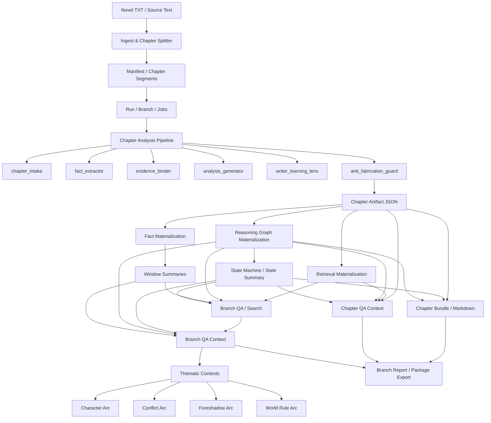

# novel-analyzer

PostgreSQL-first scaffold for a chapter-progressive 小说拆书系统.

## Next-stage structure
- `novel_analyzer/application/`: shared application/orchestration seam for CLI and future Web/API
- `apps/api/`: separate backend surface prototype
- `apps/web/`: separate frontend surface prototype

## Current scope
- 文本导入与章节规范化
- PostgreSQL-only runtime
- Alembic 迁移驱动的数据库演进
- 运行 / 分支 / checkpoint / chapter_job / raw_output 数据模型
- 逻辑隐藏式回退分支
- 手工产物保留但默认不参与下游上下文
- LangGraph 工作流骨架
- `skills_dir/` + SkillKit(`skillkit[langchain]`) 技能加载
- JSON-first chapter analysis -> PostgreSQL -> Markdown pipeline
- PostgreSQL 内 BM25 / trigram / vector 扩展探测与启用

## Newcomer Path
- 想快速上手：[`./docs/cli-operations-manual.md`](./docs/cli-operations-manual.md)
- 想看接口与样例：[`./docs/interface-manifest.md`](./docs/interface-manifest.md) + [`./docs/examples/*.sample.json`](./docs/examples/)
- 想看交付全貌：[`./docs/final-handoff.md`](./docs/final-handoff.md)
- 想看系统审查能力：[`./docs/risk-audit-capability.md`](./docs/risk-audit-capability.md)
- 想看运行时边界：[`./docs/risk-audit-runtime-boundary.md`](./docs/risk-audit-runtime-boundary.md)
- 想看 `skills_dir` 与门控 checker 的边界：[`./docs/skills-vs-risk-checkers-boundary.md`](./docs/skills-vs-risk-checkers-boundary.md)
- 想看风险审查运行时架构：[`./docs/risk-audit-runtime-architecture.md`](./docs/risk-audit-runtime-architecture.md)
- 想看 checker 路线图：[`./docs/risk-audit-checker-roadmap.md`](./docs/risk-audit-checker-roadmap.md)
- 想看风险审查系统总览：[`./docs/risk-audit-system-overview.md`](./docs/risk-audit-system-overview.md)
- 想看风险审查最终交付摘要：[`./docs/risk-audit-delivery-summary.md`](./docs/risk-audit-delivery-summary.md)
- 想看风险审查下一阶段执行建议：[`./docs/risk-audit-next-phase-30-60-90.md`](./docs/risk-audit-next-phase-30-60-90.md)
- 想看团队同步版简报：[`./docs/risk-audit-team-sync-brief.md`](./docs/risk-audit-team-sync-brief.md)
- 想看第一阶段冻结声明：[`./docs/risk-audit-phase-1-freeze-declaration.md`](./docs/risk-audit-phase-1-freeze-declaration.md)
- 想看问题簇状态语义：[`./docs/cluster-status-semantics.md`](./docs/cluster-status-semantics.md)
- 想看最小 review workflow 使用说明：[`./docs/minimal-review-workflow-guide.md`](./docs/minimal-review-workflow-guide.md)
- 想看最小 review workflow 状态机：[`./docs/minimal-review-workflow-state-machine.md`](./docs/minimal-review-workflow-state-machine.md)
- 想看 review workflow 第二阶段设计稿：[`./docs/review-workflow-phase2-design.md`](./docs/review-workflow-phase2-design.md)
- 想看 review workflow 持久化策略：[`./docs/review-workflow-persistence-strategy.md`](./docs/review-workflow-persistence-strategy.md)
- 想看 review workflow API 说明：[`./docs/review-workflow-api.md`](./docs/review-workflow-api.md)
- 想看 review workflow API 版本化策略：[`./docs/review-workflow-api-versioning.md`](./docs/review-workflow-api-versioning.md)
- 想看 review API 稳定字段收口清单：[`./docs/review-api-stability-summary.md`](./docs/review-api-stability-summary.md)
- 想看第二阶段实施优先级建议：[`./docs/review-workflow-phase2-priority-ranking.md`](./docs/review-workflow-phase2-priority-ranking.md)
- 想看 review workflow API 冻结就绪判断：[`./docs/review-workflow-api-freeze-readiness.md`](./docs/review-workflow-api-freeze-readiness.md)
- 想看 review workflow DB-only 切换策略：[`./docs/review-workflow-db-only-cutover.md`](./docs/review-workflow-db-only-cutover.md)
- 想看读者体验能力规划：[`./docs/reader-experience-capability.md`](./docs/reader-experience-capability.md)
- 想浏览全部文档：[`./docs/README.md`](./docs/README.md)

## 当前工作台入口

- `apps/web/`：Next.js + React + Ant Design 前端
- `apps/api/`：本地工作台后端

当前面向作家的主入口页面：
- `/control`：导入与继续整理
- `/reader`：章节阅读与原文回看
- `/qa`：整本小说问答 / 人物事件检索
- `/ops`：导出与恢复

其中 `/qa` 已支持：
- 聊天式问答输入
- 流式回答展示
- 引用章节跳转
- 证据摘要、推理摘要、图谱信号分组渲染

## Environment

### PostgreSQL example
```bash
export NOVEL_ANALYZER_DB_DIALECT=postgresql
export NOVEL_ANALYZER_DB_HOST=127.0.0.1
export NOVEL_ANALYZER_DB_PORT=5432
export NOVEL_ANALYZER_DB_USER=d2
export NOVEL_ANALYZER_DB_PASSWORD=d2pass
export NOVEL_ANALYZER_DB_NAME=novel_analyzer
export NOVEL_ANALYZER_DB_ADMIN_NAME=postgres
```

### LLM example
```bash
export NOVEL_ANALYZER_LLM_API_KEY='your-key'
export NOVEL_ANALYZER_LLM_BASE_URL='https://api.vip1129.cc/v1'
export NOVEL_ANALYZER_LLM_MODEL_NAME='gpt-5.4-mini'

# or copy .env.example -> .env.local and fill the secrets locally
```


### Recommended workbench runtime (current)
```bash
export NOVEL_ANALYZER_LLM_PROVIDER_NAME='vip1129'
export NOVEL_ANALYZER_LLM_BASE_URL='https://api.vip1129.cc/v1'
export NOVEL_ANALYZER_LLM_API_KEY='your-key'
export NOVEL_ANALYZER_LLM_MODEL_NAME='gpt-5.4-mini'
export NOVEL_ANALYZER_LLM_STAGE_MODEL_NAME='gpt-5.4-mini'
export NOVEL_ANALYZER_LLM_QA_MODEL_NAME='gpt-5.4-mini'
export NOVEL_ANALYZER_LLM_FALLBACK_MODEL_NAME='gpt-5.4-mini'
```

### Embedding backend example
```bash
export NOVEL_ANALYZER_EMBEDDING_BACKEND=onnx
export NOVEL_ANALYZER_EMBEDDING_MODEL_NAME=BAAI/bge-m3
export NOVEL_ANALYZER_EMBEDDING_MODEL_PATH=
export NOVEL_ANALYZER_EMBEDDING_CACHE_DIR=.cache/embeddings
```

See [`./docs/agent-skills-and-embedding.md`](./docs/agent-skills-and-embedding.md) for the internal staged agent pipeline and ONNX embedding details.

## Architecture Overview



### Reading guide
1. **输入层**：原始小说文本先经过导入与切章。
2. **分析层**：按章节进入 staged agent pipeline，产出 chapter artifact。
3. **派生层**：从 artifact 派生 retrieval、facts、reasoning graph、window、state summary。
4. **消费层**：导出 chapter/branch bundle、QA context、thematic contexts、report、package。

## Python3 install (without Poetry)
```bash
python3 -m venv .venv
source .venv/bin/activate
pip install -U pip
pip install -r requirements.txt
python3 -m novel_analyzer.cli.app init-db
python3 -m novel_analyzer.cli.app db-health
```

## Quick start

| 场景 | Poetry | Python3 |
|---|---|---|
| 安装依赖 | `poetry install` | `python3 -m venv .venv && source .venv/bin/activate && pip install -r requirements.txt` |
| 初始化数据库 | `poetry run novel-analyzer init-db` | `python3 -m novel_analyzer.cli.app init-db` |
| 数据库健康检查 | `poetry run novel-analyzer db-health` | `python3 -m novel_analyzer.cli.app db-health` |
| 查看技能 | `poetry run novel-analyzer list-skills` | `python3 -m novel_analyzer.cli.app list-skills` |
| 测 embedding | `poetry run novel-analyzer test-embedding` | `python3 -m novel_analyzer.cli.app test-embedding` |
| 查看切章结果 | `poetry run novel-analyzer inspect-novel /path/to/novel.txt` | `python3 -m novel_analyzer.cli.app inspect-novel /path/to/novel.txt` |
| 导入小说 | `poetry run novel-analyzer ingest /path/to/novel.txt --title 'sample'` | `python3 -m novel_analyzer.cli.app ingest /path/to/novel.txt --title 'sample'` |
| 一键导入并创建 run | `poetry run novel-analyzer auto-run /path/to/novel.txt --max-chapters 0` | `python3 -m novel_analyzer.cli.app auto-run /path/to/novel.txt --max-chapters 0` |
| 创建 run | `poetry run novel-analyzer start-run <novel_id> <manifest_id>` | `python3 -m novel_analyzer.cli.app start-run <novel_id> <manifest_id>` |
| 推进章节 | `poetry run novel-analyzer analyze-range <run_id> <branch_id> 1 3` | `python3 -m novel_analyzer.cli.app analyze-range <run_id> <branch_id> 1 3` |

## Workbench

### Start backend
```bash
.venv/bin/python -m apps.api.app.main
```

### Start frontend
```bash
cd apps/web
npm config set registry https://registry.npmmirror.com/
npm install
npm run dev
```

Open:

`http://127.0.0.1:4173`


### Workbench notes
- 当前控制台已经收口为面向作家的阅读型工作台，而不是技术调试页。
- 拆书失败默认会先自动重试，当前自动重试上限为 **5 次**；只有超过 5 次仍失败，才进入人工恢复流程。
- 如果你要重启 Web/API 原型，请确保后端进程实际加载的是 `.env.local` / `.env.runtime.local` 中的目标 provider 配置。

Current workbench target capabilities:
- 真实导入小说并创建 run / branch
- 读取真实 run / branch snapshot
- 启动 `manual` pipeline
- 执行恢复动作（retry-failed / clear-running / repair）
- 点击章节查看 chapter bundle / chapter QA context
- 查看原始章节正文
- 从引用里的 `第N章` 直接跳转到对应章节
- 生成 branch bundle / branch QA context / branch report 下载链接
- 人物 / 事件检索
- 基于小说内容问答（保留引用章节、证据、推理路径、图谱信号）


## Skills
Project-local skills live under:

```bash
skills_dir/
```

The current loader uses SkillKit with:
- `project_skill_dir=./skills_dir`
- `anthropic_config_dir=""`
- no plugin dirs

This keeps skill discovery scoped to repo-local skills only.

## Important semantics
- 章节是最小提交单元。
- 当前章成功后，才能继续下一章。
- 回退后续进展采用**逻辑隐藏**，默认只读 active branch。
- 手工结果允许保留，但默认 `participates_in_downstream = false`。
- JSON 是标准中间产物；后续从 JSON 入库并渲染 Markdown。
- 中文检索统一依赖 PostgreSQL 原生检索 + 扩展能力；当前强校验 `pg_trgm`、`vector`，并报告 text search config 可用性。

## Live ONNX note

If the environment cannot reach `huggingface.co`, the ONNX backend will now fail with an actionable error telling you to either:
- provide `NOVEL_ANALYZER_EMBEDDING_MODEL_PATH`, or
- enable outbound access to Hugging Face.

## More docs

### 0. 开发变更记录
- 约定：每次修复 / 变动都需要同步：文档、`CHANGELOG.md`、git commit 记录
- [`./CHANGELOG.md`](./CHANGELOG.md)：开发变更记录；后续每次开发更改都需要追加 changelog

### 1. 使用者
1. [`./docs/cli-operations-manual.md`](./docs/cli-operations-manual.md)
2. [`./docs/direct-usage-guide.md`](./docs/direct-usage-guide.md)
3. [`./docs/real-run-checklist.md`](./docs/real-run-checklist.md)
4. [`./docs/review-template.md`](./docs/review-template.md)
5. [`./docs/session-handoff-manual.md`](./docs/session-handoff-manual.md)

### 2. 接入者
1. [`./docs/interface-manifest.md`](./docs/interface-manifest.md)
2. [`./docs/examples/`](./docs/examples/)
3. [`./docs/real-run-evaluation-1-12.md`](./docs/real-run-evaluation-1-12.md)

### 3. 开发者 / 维护者
1. [`./docs/final-handoff.md`](./docs/final-handoff.md)
2. [`./docs/release-handoff-brief.md`](./docs/release-handoff-brief.md)
3. [`./docs/session-handoff-manual.md`](./docs/session-handoff-manual.md)
4. [`./docs/agent-skills-and-embedding.md`](./docs/agent-skills-and-embedding.md)
5. [`./docs/model-eval-template.md`](./docs/model-eval-template.md)
6. [`./docs/README.md`](./docs/README.md)
7. [`./apps/web/README.md`](./apps/web/README.md)
8. [`./apps/api/README.md`](./apps/api/README.md)
### PostgreSQL checks
```bash
python3 scripts/check_postgres.py
poetry run novel-analyzer db-capabilities
```

会检查：
- 数据库是否存在
- 是否可连接
- Alembic / 关键表是否已初始化
- `pg_trgm`
- `vector`
- text search config

- 若 `npm run build` 出现页面模块缺失（例如 `/ops`）但源码文件实际存在，先删除 `apps/web/.next` 再重新构建。

- 当 provider 额度耗尽导致章节失败时，控制台首页会直接提示失败章节与恢复入口。

- 工作台现已将“小说问答”拆为单独的导航页签，不再和章节阅读混在同一长页面里。

- 首页 `/` 现直接渲染控制台，不再依赖前端运行时重定向到 `/control`，避免 Next.js build 在收集 page data 时失稳。
