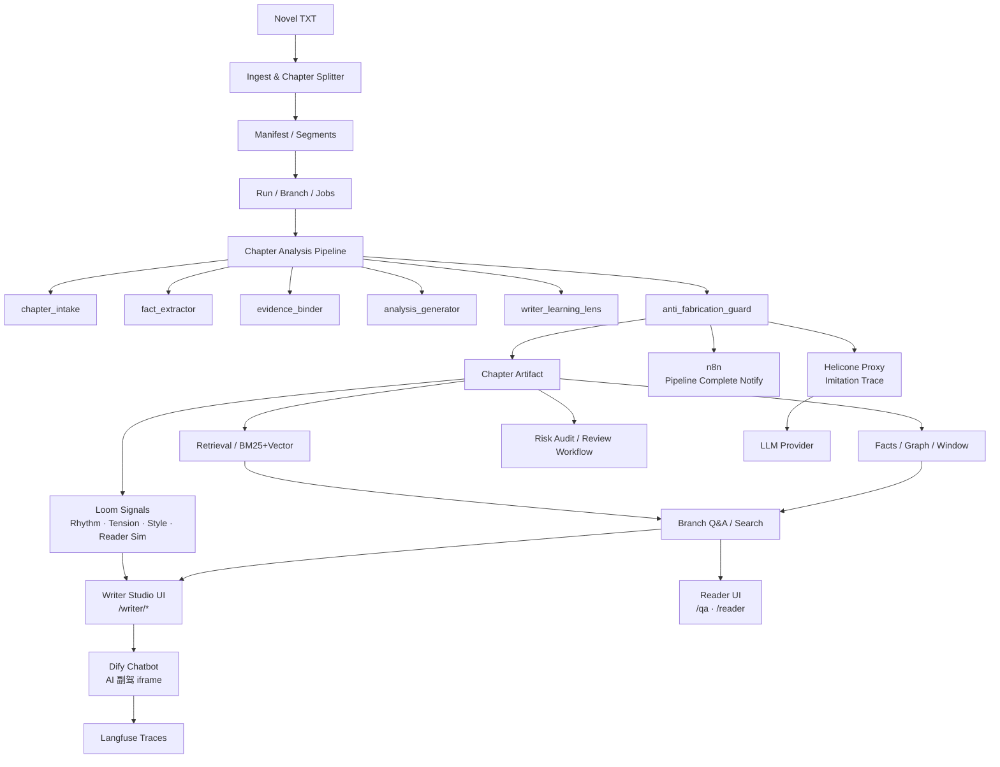

# novel-analyzer · AI 小说助手平台

> v0.2.4 — 面向作家与读者的 AI 小说理解、创作辅助与阅读增强系统。

---

## 产品定位

这不是通用 AI 写作器，而是面向长篇小说的**内容理解 + 风险门控 + 受控生成**平台，服务两类用户：

| 用户 | 核心价值 |
|------|---------|
| **作家 / 工作室** | 仿写辅助、Loom 信号实时反馈、风险门控、连续性审查 |
| **读者** | 章节 Q&A、引用跳转、人物事件检索、防剧透摘要 |

---

## 核心能力

### 拆书与检索
- 章节切分 + 规范化
- BM25 / trigram / vector 混合检索（PostgreSQL 原生）
- 推理图谱（人物 / 事件 / 因果 / 伏笔）
- 窗口摘要 / 状态机
- **P0 锁定基线**：simple R@5 = 0.81，jieba R@5 = 0.84，5 本书 587 docs 验证（domain dict + pg_jieba + bm25_vector 三件套已固化）

### 风险门控
- 语义风险信号（OOC / 规则漂移 / 时间线 / 战力）
- 集群审查工作流（review cluster / batch execute）
- 风险证据包导出
- 9 个 checker 进入 mainline，preflight + harness routing 已就绪

### 受控仿写
- **章节级仿写**（`imitate-chapter` / `iterate-imitation` / `review-imitation`）— 全部支持 `--world-map / --character-map / --power-map / --rule-override` 等映射 flag
- **整本仿写编排**（`writer-imitate-range`）— per-chapter 增量保存、auto-retry（thin / scaffold / action-queue 三类 contamination 实时拦截）
- **跨题材改写（mapping_pack）— 已突破**：3 套目标题材验证，**170/171 章 verdict=pass（99.4%）**，mapping accuracy 96-98%（卫图→科幻 102/102，诛仙→科幻 58/59，卫图→都市修真 10/10）
- 同题材 baseline self-check 已加入 prompt，待长跑验证（[handoff](./docs/baseline-imitation-quality-validation-handoff-20260515.md)）
- Loom 信号：节奏 / 张力 / 风格对照 / 读者模拟（4 视角）
- 修复通道 + 长篇连续性诊断

### 读者 Q&A
- 流式问答（RAG + 图谱推理）
- 引用章节可跳转
- 人物 / 事件检索
- 证据摘要 + 推理路径渲染

---

## 商用就绪状态（2026-05-15）

| 能力 | 状态 | 实证 |
|---|---|---|
| **跨题材改写**（B2B API） | ✅ 技术 ready | 170/171 pass / 1M+ 字 / 3 题材 |
| 章节 Q&A + 引用跳转 | ✅ 可用 | R@5 0.81+ 跨 5 本书 |
| 风险审查工作流 | ✅ 可用 | 9 checker mainline |
| 仿写辅助（作家工作台） | ⚠️ 辅助级 | harness + Loom 信号成熟，不能宣称 "AI 自动写书" |
| 同题材整本仿写 | 🔧 验证中 | 0/307 → 已修复 prompt，待 Stage A/B/C 长跑 |
| 多租户 SaaS | ❌ 未就绪 | 6 项 infra gap（计费/限流/fallback/隔离/版权/监控） |

详细决策表：[`docs/cross-genre-imitation-commercial-readiness-20260515.md`](./docs/cross-genre-imitation-commercial-readiness-20260515.md)
能力全景：[`docs/chapter-imitation-capability-matrix.md`](./docs/chapter-imitation-capability-matrix.md)

---

## 技术栈

| 层 | 技术 |
|----|------|
| 后端 | Python 3.11 · FastAPI / WSGI · LangGraph · SQLAlchemy |
| 数据库 | PostgreSQL（pg_trgm / pgvector / pg_jieba） |
| 前端 | Next.js 15 · React 18 · Ant Design 5 |
| AI 编排 | Dify（Chatbot / Workflow / Prompt Studio） |
| 外围自动化 | n8n（通知 / 日报 / 第三方集成） |
| 可观测性 | Langfuse（Dify 内置集成）· Helicone（LLM proxy trace） |
| Embedding | ONNX（本地）/ HTTP（TEI / OpenAI / Jina） |

---

## 用户界面入口

### 作家端 — Writer Studio
```
http://127.0.0.1:4173/writer/<branch_id>
```
- 编辑器画布（autosave）
- Loom 信号侧栏（节奏 / 张力 / 风格 / 伏笔密度）
- AI 副驾（Dify Chatbot iframe，流式 + 引用）
- 版本树（仿写分支管理）

### 读者端 — Reader Studio
```
http://127.0.0.1:4173/reader/<branch_id>
```
- 三栏布局：左侧章节导航 / 中央阅读 / 右侧 Q&A
- 章节导航：摘要预览 + 吸引度评分 + 风险标签 + 搜索过滤
- 防剧透 Q&A：默认只用 ≤ 当前章节的数据回答，可关闭
- 读者体验评分：4视角（普通读者 / 资深读者 / 情感满足 / 编辑视角）
- 读者反馈：1-5 星评分 + 评论，汇总展示

### 旧工作台（Workbench）
```
http://127.0.0.1:4173
```
| 页面 | 功能 |
|------|------|
| `/control` | 导入 + 启动 + 恢复 |
| `/reader` | 章节阅读 + 原文回看 |
| `/qa` | 整本问答 / 人物事件检索（流式 + 引用跳转） |
| `/pipeline` | Pipeline 编排与进度 |
| `/quality` | 质量仪表盘 |
| `/ops` | 导出 + 恢复 |

---

## 文档入口

| 我是… | 入口 |
|-------|------|
| 产品 / 业务 | [`docs/roles/product/`](./docs/roles/product/README.md) |
| 后端 / 架构师 | [`docs/roles/backend/`](./docs/roles/backend/README.md) |
| 接入者（API/前端） | [`docs/roles/integrator/`](./docs/roles/integrator/README.md) |
| 维护者 / 接手人 | [`docs/roles/maintainer/`](./docs/roles/maintainer/README.md) |
| 仿写 / 创作 | [`docs/roles/imitation/`](./docs/roles/imitation/README.md) |
| 直接使用 CLI | [`docs/cli-operations-manual.md`](./docs/cli-operations-manual.md) |
| **运维调试速查** | [`docs/ops-debug-manual-20260514.md`](./docs/ops-debug-manual-20260514.md) |
| **跨题材改写商用就绪** | [`docs/cross-genre-imitation-commercial-readiness-20260515.md`](./docs/cross-genre-imitation-commercial-readiness-20260515.md) |
| **同题材修复长跑验证** | [`docs/baseline-imitation-quality-validation-handoff-20260515.md`](./docs/baseline-imitation-quality-validation-handoff-20260515.md) |
| 商业化路线图 | [`docs/strategy/writer-studio-roadmap.md`](./docs/strategy/writer-studio-roadmap.md) |
| 端到端运维 | [`docs/runbook/business-loop.md`](./docs/runbook/business-loop.md) |
| 全部文档 | [`docs/README.md`](./docs/README.md) |

---

## 快速启动

### 1. 安装依赖
```bash
python3 -m venv .venv
source .venv/bin/activate
pip install -r requirements.txt
```

### 2. 初始化数据库
```bash
cp .env.example .env.local   # 填写 DB / LLM 配置
.venv/bin/python -m novel_analyzer.cli.app init-db
alembic upgrade head
```

### 3. 启动后端
```bash
make api-dev
# uvicorn 启动 FastAPI on http://127.0.0.1:8011
# legacy fallback (cutover 完成后移除): make api-wsgi-legacy
```

### 4. 启动前端
```bash
cd apps/web
npm install
npm run dev
# 默认监听 :4173
```

### 5. 导入小说并开始分析
```bash
# CLI 一键导入
.venv/bin/python -m novel_analyzer.cli.app auto-run /path/to/novel.txt --max-chapters 0

# 或通过 Workbench UI
open http://127.0.0.1:4173/control
```

### 6. 仿写示例（5-章 spike）
```bash
# 同题材
.venv/bin/python -m novel_analyzer.cli.app writer-imitate-range \
  <branch_id> "2:目标A" "3:目标B" "4:目标C" "5:目标D" "6:目标E" \
  --output-dir output/spike --use-llm --max-rounds 2

# 跨题材改写（mapping_pack，已验证 99.4% pass）
.venv/bin/python -m novel_analyzer.cli.app writer-imitate-range \
  <branch_id> "2:目标A" "3:目标B" \
  --output-dir output/scifi --use-llm --max-rounds 2 \
  --world-map "郑国=星际联邦" --character-map "卫图=魏拓" \
  --power-map "养生功=星能调息术" \
  --rule-override "封建奴籍替换为合同义务工"
```

详见 [`docs/whole-book-quickstart-20260514.md`](./docs/whole-book-quickstart-20260514.md)

---

## 环境变量

### 数据库
```bash
NOVEL_ANALYZER_DB_DIALECT=postgresql
NOVEL_ANALYZER_DB_HOST=127.0.0.1
NOVEL_ANALYZER_DB_PORT=5432
NOVEL_ANALYZER_DB_USER=d2
NOVEL_ANALYZER_DB_PASSWORD=replace-me
NOVEL_ANALYZER_DB_NAME=novel_analyzer
NOVEL_ANALYZER_DB_ADMIN_NAME=postgres
```

### LLM
```bash
NOVEL_ANALYZER_LLM_PROVIDER_NAME=deepseek
NOVEL_ANALYZER_LLM_BASE_URL=https://api.deepseek.com/v1
NOVEL_ANALYZER_LLM_API_KEY=replace-me
NOVEL_ANALYZER_LLM_MODEL_NAME=deepseek-v4-flash
NOVEL_ANALYZER_LLM_STAGE_MODEL_NAME=deepseek-v4-flash
NOVEL_ANALYZER_LLM_QA_MODEL_NAME=deepseek-v4-flash
NOVEL_ANALYZER_LLM_FALLBACK_MODEL_NAME=deepseek-v4-flash

# v3: 透明 LLM proxy（Helicone），不设则直连
# NOVEL_ANALYZER_LLM_BASE_URL_OVERRIDE=http://localhost:8585/v1/openai
```

### Embedding
```bash
NOVEL_ANALYZER_EMBEDDING_BACKEND=onnx
NOVEL_ANALYZER_EMBEDDING_MODEL_NAME=BAAI/bge-m3
NOVEL_ANALYZER_EMBEDDING_MODEL_PATH=/absolute/path/to/bge-m3-onnx
NOVEL_ANALYZER_EMBEDDING_CACHE_DIR=.cache/embeddings
```

### 外围集成（v3 新增，可选）
```bash
# n8n pipeline 完成通知（不设则静默）
# N8N_WEBHOOK_PIPELINE_COMPLETE_URL=http://localhost:5678/webhook/pipeline-complete

# Dify Writer Copilot（前端 iframe 嵌入）
# NEXT_PUBLIC_DIFY_BASE_URL=http://localhost:8080
# NEXT_PUBLIC_DIFY_WRITER_COPILOT_TOKEN=app-xxxxxxxxxx
```

---

## 自托管 Infra（可选）

所有 infra 组件均为独立 docker-compose，互不依赖，按需启动：

| 组件 | 端口 | 用途 | 启动 |
|------|------|------|------|
| **Dify** | 8080 | Chatbot / Prompt Studio / Workflow | `infra/dify/README.md` |
| **n8n** | 5678 | 通知 / 日报 / 第三方集成 | `cd infra/n8n && docker compose up -d` |
| **Langfuse** | 3030 | LLM trace（Dify 内置集成） | `infra/langfuse/README.md` |
| **Helicone** | 8585 | LLM proxy trace（imitation 主流量） | `infra/helicone/README.md` |

完整启动流程见 [`docs/runbook/v3-pickup-checklist.md`](./docs/runbook/v3-pickup-checklist.md)。

---

## 架构概览



---

## 开发命令

```bash
# 测试
.venv/bin/python -m pytest tests/ -q                  # 全量
.venv/bin/python -m pytest tests/test_imitation*.py   # 仿写相关
make v3-smoke                                          # e2e 烟雾测试

# 后端
make api-dev                                           # uvicorn FastAPI on :8011
make api-wsgi-legacy                                   # WSGI 兜底（cutover 后移除）

# 前端
cd apps/web && npm run dev                             # Next.js on :4173
cd apps/web && npm run build                           # 生产构建

# Infra
make v2-up-all                                         # Dify + n8n + Langfuse
make v2-down-all                                       # 全部下线
make v2-status                                         # plan 进度
make v2-pickup-checklist                               # infra 启动步骤
make tei-up / tei-doctor                               # TEI embedding（可选）

# CLI（最常用）
.venv/bin/python -m novel_analyzer.cli.app --help
.venv/bin/python -m novel_analyzer.cli.app retrieval-benchmark <branch_id>
.venv/bin/python -m novel_analyzer.cli.app writer-imitate-range <branch_id> ...
```

详见 [`docs/cli-operations-manual.md`](./docs/cli-operations-manual.md) + [`docs/ops-debug-manual-20260514.md`](./docs/ops-debug-manual-20260514.md)

---

## 重要语义

- 章节是最小提交单元，当前章成功后才能继续下一章
- 回退采用**逻辑隐藏**，默认只读 active branch
- 手工结果允许保留，但默认 `participates_in_downstream = false`
- 拆书失败自动重试上限 **5 次**，超过后进入人工恢复流程
- 中文检索依赖 PostgreSQL 原生扩展（pg_trgm / pgvector / pg_jieba）

---

## 更多文档

- 变更记录：[`CHANGELOG.md`](./CHANGELOG.md)
- 完整文档中心：[`docs/README.md`](./docs/README.md)
- 当前 API surface：[`docs/api-current-surface.md`](./docs/api-current-surface.md)
- 商业化路线图：[`docs/strategy/writer-studio-roadmap.md`](./docs/strategy/writer-studio-roadmap.md)
