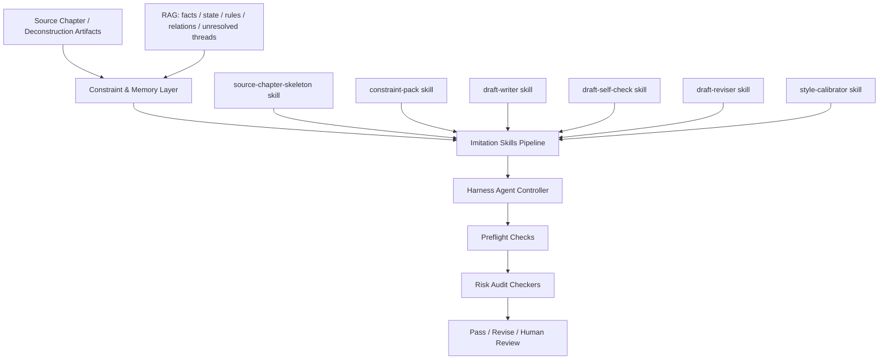

# 章节仿写能力最终推荐架构（skills + harness + risk audit）

> 状态：**当前推荐规划 / 后续实现基线**
>
> 目标：把“章节仿写 / 全书仿写”从单次大模型生成，升级为 **受控生产系统**。

---

## 1. 为什么要升级

如果只采用：

> LLM 直接写草案 → risk audit 审查 → 不通过再重写

会出现几个问题：

1. 修复方向不稳定  
2. 每轮修改容易引入新的偏移  
3. risk audit 被迫承担“纠错器”职责，而不是“门控器”职责  
4. 很容易陷入“反复不过审”的低效循环

所以推荐升级为：

> **约束输入层 + skills 生产链 + harness agent 控制层 + risk audit 门控层**

---

## 2. 最终推荐分层



---

## 3. 四层职责边界

## 3.1 Constraint & Memory Layer

负责给仿写提供“不能乱写”的上下文：

- source chapter skeleton
- 当前 branch 的人物状态
- 关系状态
- 世界规则 / 约束
- 未解线程
- 上一生成章节的 carry-over state

这里的重点不是“生成”，而是：

> 让后续生成阶段始终带着**真实约束**工作。

---

## 3.2 Imitation Skills Pipeline

`skills_dir` 里的 skill 不负责总控，而负责**明确阶段动作**。

建议拆成以下几类：

### A. `source-chapter-skeleton`
输入：
- source chapter text / excerpt

输出：
- chapter goal
- scene beats
- conflict progression
- ending hook
- reveal order

### B. `imitation-constraint-pack`
输入：
- branch context
- rule state
- relationship state
- unresolved threads
- mapping pack

输出：
- hard constraints
- soft constraints
- forbidden transformations
- continuity memory pack

### C. `draft-writer`
输入：
- skeleton
- constraint pack
- target goal

输出：
- structured draft

### D. `draft-self-check`
输入：
- draft
- source skeleton
- constraints

输出：
- self defects
- likely gate failures
- recommended revise actions

### E. `draft-reviser`
输入：
- previous draft
- targeted defects
- fixed revision scope

输出：
- revised draft

### F. `style-calibrator`
输入：
- draft
- style axes

输出：
- style-tuned draft

注意：

> skill 只做局部职责，不做全局决策。

---

## 3.3 Harness Agent Controller

这是后续最关键的新层。

它不直接负责“写文”，而负责：

1. 决定调用哪些 skill
2. 决定执行顺序
3. 读取 comparison / review / gate / risk 结果
4. 判断失败属于哪一类
5. 决定下一轮修复策略
6. 控制最大轮数
7. 达不到阈值时降级到 human review

也就是：

> **writer 负责写，harness 负责让它写对。**

### Harness 的核心判断分流

如果失败是：

- `structure mismatch` → 回到 skeleton / plan 修复
- `character_ooc` → 回到 constraint / motivation / relationship support 修复
- `world_rule_consistency` → 回到 rule pack / forbidden transformations 修复
- `style weak but structure okay` → 走 style-calibrator
- `risk low but score low` → 走 quality-oriented revise

所以 harness 不是“重跑一遍”，而是：

> **按失败类型做定向修复。**

---

## 3.4 Risk Audit Layer

risk audit 的职责必须保持纯粹：

- 判定风险
- 给出原因
- 给出证据
- 给出 counter-evidence
- 产出 pass / revise / human-review 建议

而不是直接承担：

- 生成正文
- 自由改文
- 替代仿写控制器

因此最终边界应是：

> risk audit 是 **门控器**，不是 **写作器**。

---

## 4. 推荐运行流程

## 4.1 单章仿写

```text
source chapter
-> source-chapter-skeleton
-> imitation-constraint-pack
-> draft-writer
-> draft-self-check
-> harness decision
-> draft-reviser / style-calibrator
-> preflight checks
-> risk audit
-> pass / revise / human review
```

---

## 4.2 多章连续仿写

```text
chapter N final carry_over_state
-> chapter N+1 constraint pack
-> draft writer
-> harness revise loop
-> risk audit
-> new carry_over_state
```

重点是：

- 关系状态要继承
- 未解线程要继承
- 规则变化要继承
- 上一章生成摘要要继承

---

## 4.3 全书仿写

全书层不应直接“一键全文生成”，而应拆成：

1. mapping pack
2. chapter goals
3. queue
4. sandbox execution
5. aggregate evaluation

当前系统已经具备：

- `plan-whole-book-imitation`
- `run-whole-book-imitation`
- `carry_over_inputs`
- `sandbox execute`

后续就是把 harness 正式接进去。

---

## 5. Preflight Checks（正式 risk audit 前）

建议新增一层 preflight，而不是每次都直接进入正式审查。

建议至少包括：

1. source skeleton alignment check
2. character motivation precheck
3. relationship continuity precheck
4. rule violation precheck
5. ending hook completion check
6. chapter goal completion check

如果 preflight 已明显失败：

- 直接回到 harness revise
- 不占正式审查链

这样能显著降低“反复不过审”的成本。

---

## 6. 输入输出 contract 建议

## 6.1 输入

建议统一为四类：

### A. Source Anchor
- source chapter index / range
- source title
- source excerpt
- source skeleton

### B. Target Transformation
- target goal
- world mapping
- character mapping
- faction mapping
- power mapping

### C. Continuity Memory
- previous generated summary
- previous relationship state
- previous unresolved threads
- previous rule state

### D. Gate Constraints
- risk focus
- forbidden transformations
- rule overrides
- target score threshold

---

## 6.2 输出

建议统一为五类：

1. `plan`
2. `draft`
3. `comparison/review/gate/risk`
4. `carry_over_state`
5. `final_verdict`

这样后续不管是：

- 本地 CLI
- API
- agentOS
- 批处理 runner

都能复用同一套 contract。

---

## 7. 与本地 skills_dir 的关系

用户之前的一个关键问题是：

> 仿写能力是否也应该像拆书那样，依赖本地 `skills_dir`？

答案是：**应该，而且推荐采用“多小 skill + harness”模式。**

原因：

- skill 更容易稳定
- skill 更容易单独测试
- skill 更容易替换 prompt
- skill 更容易接不同模型
- harness 更容易做策略分流

因此最终不是：

> 一个超大仿写 skill

而是：

> 多个窄职责 skill，由 harness agent 编排

---

## 8. 与 RAG / Retrieval 的关系

仿写不是纯创作，它强依赖记忆与约束召回。

RAG / retrieval 在这里主要服务：

- 人物状态召回
- 世界规则召回
- 关系状态召回
- 伏笔与未解线程召回
- source chapter skeleton / similar scene retrieval

即：

> RAG 负责“记得住”，LLM 负责“写得出”，harness 负责“写得对”。

---

## 9. 当前实现位置与后续改造方向

当前已实现主链：

- `NextChapterPlannerService`
- `ChapterImitationService`
- `WholeBookImitationService`
- `iterate-imitation`
- `multi-chapter-imitation-consistency`
- `run-whole-book-imitation --execute`

后续新增优先级建议：

### P0
1. 把 harness controller 落成独立 service
2. 把 imitation skills contract 固化到 `skills_dir`
3. 加 preflight checks

### P1
4. 给 harness 增加 failure-type routing
5. 给 whole-book sandbox run 增加 aggregate evaluation
6. 给 carry-over state 增加更稳定序列化与可回放能力

### P2
7. 接 agentOS orchestration
8. 做更强的 style calibration / prose scoring
9. 做全文级 imitation audit

---

## 10. 最终一句话架构结论

后续章节仿写 / 全书仿写的正确方向不是：

> “让一个模型更努力地一次写对”

而是：

> **把仿写做成：RAG 约束输入 + skills 分阶段生产 + harness agent 定向修复 + risk audit 最终门控 的受控生成系统。**

