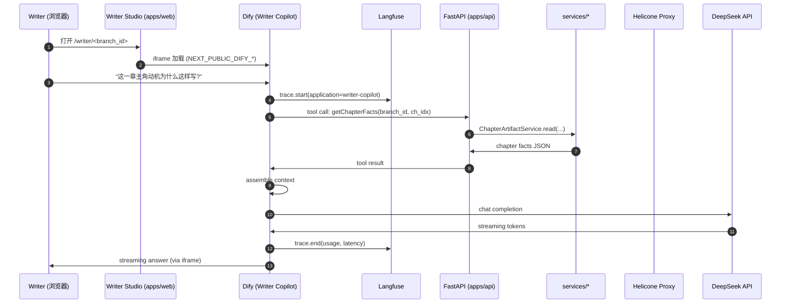
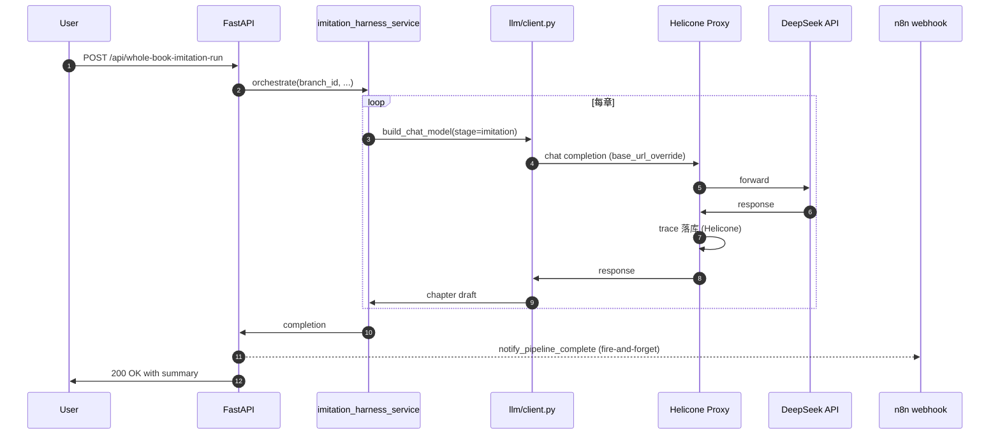
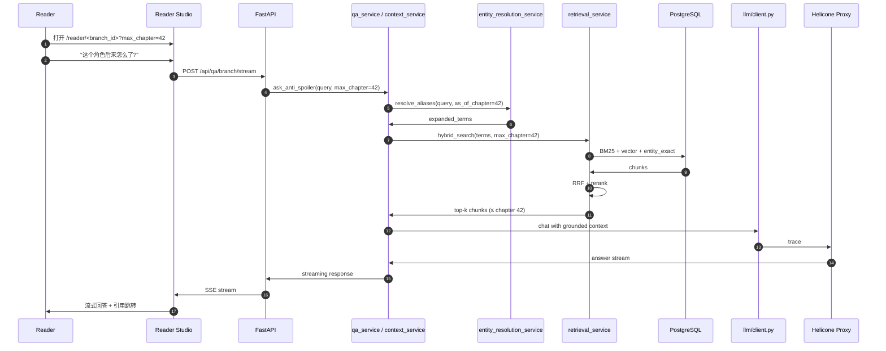
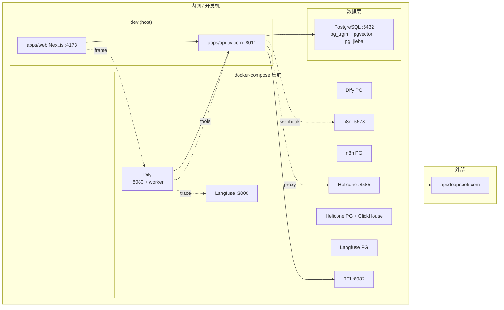
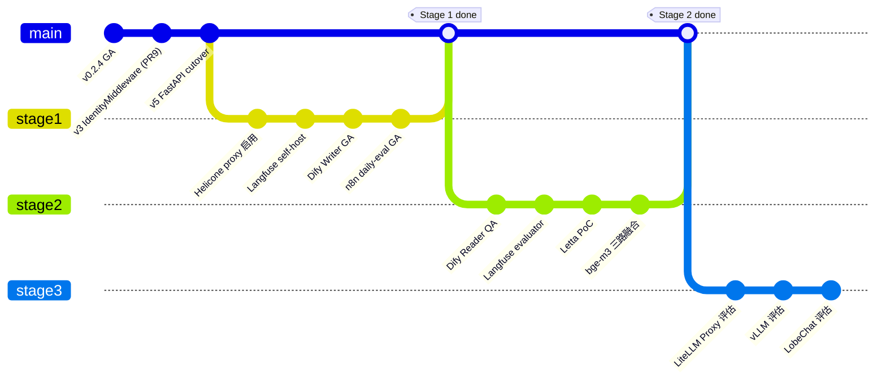

# External Integration Architecture — 2026-05-14

> **范围**:novel-analyzer 内核与外部生态的分层架构图。
> **配套**:`docs/strategy/external-integration-roadmap-20260514.md`(决策依据)、`docs/strategy/external-integration-checklist-20260514.md`(落地清单)。
> **图例**:`✅` 已 GA;`🟡` 已写代码未启用;`🔴` 路线规划。

---

## 1. 总览(分层视图)

```mermaid
flowchart TB
    subgraph UI["UI 面"]
        UI_W["Writer Studio<br/>apps/web /writer<br/>✅"]
        UI_R["Reader Studio<br/>apps/web /reader<br/>✅"]
        UI_LB["LobeChat<br/>(社群分发)<br/>🔴 Stage 3"]
        UI_OW["OpenWebUI<br/>(开发者面)<br/>🔴 Stage 3"]
    end

    subgraph ORCH["编排面"]
        ORCH_DIFY["Dify<br/>Writer Copilot / Reader QA<br/>🟡→✅ Stage 1"]
        ORCH_N8N["n8n<br/>daily-eval / pipeline-notify<br/>🟡→✅ Stage 1"]
        ORCH_LITE["LiteLLM Proxy<br/>多 provider 路由<br/>🔴 Stage 3"]
    end

    subgraph API["接入面 (apps/api)"]
        API_FAST["FastAPI<br/>create_app() / 11 routers<br/>✅"]
        API_MW["IdentityMiddleware<br/>X-User-Id<br/>✅"]
        API_WSGI["WSGI fallback<br/>/api/review-batch-execute<br/>(legacy 1 endpoint)<br/>✅"]
    end

    subgraph KERNEL["内核面 (novel_analyzer)"]
        K_SVC["services/* 60 files<br/>retrieval / qa / imitation /<br/>loom / risk_audit / reader_sim<br/>✅"]
        K_LLM["llm/client.py<br/>build_chat_model<br/>✅"]
        K_PROMPT["llm/prompts.py<br/>(不动)<br/>✅"]
        K_EMB["embedding/service.py<br/>backend = onnx | http | tei<br/>✅"]
        K_RR["rerank/service.py<br/>backend = onnx | http | tei<br/>✅"]
        K_NOTIFY["runtime/notify.py<br/>fire-and-forget webhook<br/>🟡→✅ Stage 1"]
    end

    subgraph OBS["观测面"]
        OBS_HEL["Helicone proxy<br/>llm/client 直连流量<br/>🟡→✅ Stage 1"]
        OBS_LF["Langfuse<br/>Dify 应用流量<br/>🟡→✅ Stage 1"]
        OBS_OTEL["OpenLLMetry / OTel<br/>🔴 Stage 3"]
    end

    subgraph MEM["记忆面"]
        MEM_INT["内核分层记忆<br/>memory_consolidation<br/>memory_assembler<br/>arc_memory<br/>✅"]
        MEM_LETTA["Letta<br/>跨 session 记忆<br/>🔴 Stage 2 PoC"]
        MEM_MEM0["Mem0<br/>(备选)<br/>🔴"]
    end

    subgraph INFRA["推理基础设施"]
        INFRA_TEI["TEI<br/>embedding + rerank<br/>✅"]
        INFRA_ONNX["ONNX 本地<br/>bge-m3 / bge-reranker<br/>✅"]
        INFRA_PG["PostgreSQL<br/>pg_trgm + pgvector + pg_jieba<br/>✅"]
        INFRA_LLM["DeepSeek API<br/>v4-flash<br/>✅"]
        INFRA_VLLM["vLLM 自托管<br/>🔴 Stage 3"]
    end

    UI_W --> ORCH_DIFY
    UI_W --> API_FAST
    UI_R --> API_FAST
    UI_R -.Stage 2.-> ORCH_DIFY
    UI_LB -.Stage 3.-> ORCH_DIFY
    UI_OW -.Stage 3.-> ORCH_DIFY

    ORCH_DIFY --> API_FAST
    ORCH_DIFY --> OBS_LF
    ORCH_N8N --> API_FAST
    ORCH_N8N <-.webhook.- K_NOTIFY

    API_FAST --> API_MW
    API_FAST --> K_SVC
    API_FAST --> API_WSGI

    K_SVC --> K_LLM
    K_SVC --> K_EMB
    K_SVC --> K_RR
    K_SVC --> INFRA_PG
    K_SVC --> MEM_INT
    K_SVC --> K_NOTIFY

    K_LLM -.proxy.-> OBS_HEL
    OBS_HEL --> INFRA_LLM
    OBS_HEL -.fallback direct.-> INFRA_LLM
    K_LLM -.bypass.-> INFRA_LLM

    K_EMB --> INFRA_ONNX
    K_EMB --> INFRA_TEI
    K_RR --> INFRA_ONNX
    K_RR --> INFRA_TEI

    ORCH_DIFY -.Stage 2.-> MEM_LETTA
    UI_R -.Stage 2 PoC.-> MEM_LETTA

    ORCH_LITE -.Stage 3.-> INFRA_LLM
    ORCH_LITE -.Stage 3.-> INFRA_VLLM
    K_LLM -.Stage 3.-> ORCH_LITE

    OBS_OTEL -.Stage 3.-> OBS_LF

    classDef done fill:#d4edda,stroke:#28a745,color:#000
    classDef wired fill:#fff3cd,stroke:#ffc107,color:#000
    classDef planned fill:#f8d7da,stroke:#dc3545,color:#000

    class UI_W,UI_R,API_FAST,API_MW,API_WSGI,K_SVC,K_LLM,K_PROMPT,K_EMB,K_RR,MEM_INT,INFRA_TEI,INFRA_ONNX,INFRA_PG,INFRA_LLM done
    class ORCH_DIFY,ORCH_N8N,OBS_HEL,OBS_LF,K_NOTIFY wired
    class UI_LB,UI_OW,ORCH_LITE,OBS_OTEL,MEM_LETTA,MEM_MEM0,INFRA_VLLM planned
```

### 1.1 阅读顺序

`UI 面` → `编排面` → `接入面` → `内核面` → `推理基础设施`(主调用链)
`内核面` → `观测面`(旁路 trace)
`内核面` ↔ `记忆面`(双向)
`编排面` → `观测面`(应用层 trace)

---

## 2. 数据流主链

### 2.1 Writer Copilot 问答(Stage 1 GA 后)



**关键点**:Dify 应用层流量进 Langfuse;novel_analyzer 内核此路径**没有**直接触达 LLM,所以 Helicone trace 这条链没有数据。

### 2.2 Imitation 主流量(Stage 1 GA 后)



**关键点**:imitation 是大头流量(几十次 LLM 调用 / 章),全部进 Helicone。webhook 异步发到 n8n,失败不影响主流程。

### 2.3 Reader QA 防剧透(Stage 1 后,Stage 2 候选切 Dify)



**关键点**:防剧透是**内核保证**(`as_of_chapter` 穿透),Helicone 仅 trace,不参与决策。

---

## 3. 部署拓扑(Stage 1 后)



### 3.1 端口约定

| 端口 | 服务 | 备注 |
|---|---|---|
| 8011 | apps/api(uvicorn) | FastAPI 主接入面 |
| 4173 | apps/web | Next.js dev server |
| 8080 | Dify | 主控台 + chat |
| 5678 | n8n | basic auth = admin/novel_n8n_dev(必改) |
| 8585 | Helicone | LLM proxy |
| 3000 | Langfuse | UI |
| 8082 | TEI | embedding + rerank |
| 5432 | PostgreSQL | 主库(novel-analyzer 共用) |

### 3.2 资源占用预估(Stage 1)

| 项 | 内存 | 磁盘 |
|---|---|---|
| apps/api + apps/web | 1G | — |
| ONNX 模型加载 | 2G | 8G |
| PostgreSQL | 2G | 视数据 |
| Dify 全栈 | 4G | 5G |
| n8n | 0.5G | 1G |
| Helicone(无 ClickHouse 简化版) | 1G | 5G |
| Langfuse(无 ClickHouse 简化版) | 1G | 5G |
| TEI(可选,GPU 推荐) | 4G | 6G |
| **总计** | ~15G | ~30G |

---

## 4. 边界与契约

### 4.1 内核 → 外部(出向)

| 出向接口 | 协议 | 触发点 | 失败处理 |
|---|---|---|---|
| LLM 调用 | OpenAI-compat | `llm/client.py` | Helicone 故障 → fallback 直连(env 改回) |
| Embedding | OpenAI/TEI HTTP | `embedding/service.py` | http 故障 → fallback ONNX(`embedding_fallback_backend=onnx`) |
| Rerank | TEI HTTP | `rerank/service.py` | http 故障 → DisabledRerankProvider |
| Webhook | HTTP POST | `runtime/notify.py` | fire-and-forget,2s timeout,异常 catch |

### 4.2 外部 → 内核(入向)

| 入向接口 | 协议 | 进入点 | 鉴权 |
|---|---|---|---|
| Dify Tools | OpenAPI 3.0 | `apps/api/app/routers/*` | `IdentityMiddleware`(X-User-Id) |
| n8n HTTP Request | REST | `apps/api/app/routers/*` | 同上 |
| Reader/Writer Studio | REST + SSE | 同上 | 同上 |

### 4.3 不允许的接口

外部对接**不能**:

- 直连 PostgreSQL(只能走 apps/api)
- 直接 import `novel_analyzer.services.*`
- 改动 `prompts.py`
- 注入新的 ORM
- 增加新的身份层(IdentityMiddleware 是唯一鉴权点)

---

## 5. 演进视图(本文档版本节奏)



---

## 6. 状态总表(2026-05-14 快照)

| 系统 | 类别 | 状态 | 启用阶段 | 配置位置 |
|---|---|---|---|---|
| Writer Studio | UI | ✅ | — | `apps/web/src/app/writer` |
| Reader Studio | UI | ✅ | — | `apps/web/src/app/reader` |
| FastAPI | 接入 | ✅ | — | `apps/api/app/fastapi_app.py` |
| IdentityMiddleware | 接入 | ✅ | — | `apps/api/app/middleware/identity.py` |
| novel_analyzer.services | 内核 | ✅ | — | 60 files |
| llm/client.py | 内核 | ✅ | — | `novel_analyzer/llm/client.py` |
| ONNX embedding/rerank | 推理 | ✅ | — | `novel_analyzer/{embedding,rerank}/service.py` |
| TEI | 推理 | ✅ | — | `scripts/dev/docker-compose.tei.yml` |
| PostgreSQL | 数据 | ✅ | — | `infra/`(已有) |
| DeepSeek API | LLM | ✅ | — | `.env.local` |
| 内核分层记忆 | 记忆 | ✅ | — | `memory_consolidation/assembler/arc_memory` |
| Dify | 编排 | 🟡 | Stage 1 | `infra/dify/` |
| n8n | 编排 | 🟡 | Stage 1 | `infra/n8n/` |
| Helicone | 观测 | 🟡 | Stage 1 | `infra/helicone/` + `LLM_BASE_URL_OVERRIDE` |
| Langfuse | 观测 | 🟡 | Stage 1 | `infra/langfuse/` + Dify 集成 |
| runtime/notify | 出向 | 🟡 | Stage 1 | `runtime/notify.py` + `N8N_WEBHOOK_*` |
| Dify Reader QA | 编排 | 🔴 | Stage 2 | — |
| Langfuse evaluator | 观测 | 🔴 | Stage 2 | — |
| Letta | 记忆 | 🔴 | Stage 2 PoC | — |
| bge-m3 三路 | 推理 | 🔴 | Stage 2 | — |
| LiteLLM Proxy | 编排 | 🔴 | Stage 3 | — |
| vLLM 自托管 | 推理 | 🔴 | Stage 3 | — |
| LobeChat | UI | 🔴 | Stage 3 | — |
| OpenLLMetry | 观测 | 🔴 | Stage 3 | — |

---

## 7. 配套文档导航

- 决策依据:`docs/strategy/external-integration-roadmap-20260514.md`
- 落地清单:`docs/strategy/external-integration-checklist-20260514.md`
- 内核基线:`docs/strategy/kernel-sota-gap-assessment-20260514.md`
- 历史评估:
  - `docs/observability/helicone-vs-langfuse.md`
  - `docs/research/fastgpt-vs-dify.md`
  - `docs/foundation-optimization/tei-integration-postmortem-20260512.md`

---

## 8. 修订记录

| 版本 | 日期 | 变更 |
|---|---|---|
| 1.0 | 2026-05-14 | 初版,涵盖 Stage 1-3 路线 |
