# Imitation Commercial Agent Control-Plane Architecture / 仿写商业 Agent 控制层架构（2026-05-09）

这份文档给出当前仿写商业 Agent 控制层的**完整最新架构图**。

目标不是只解释某一个 CLI 或某一个 JSON，而是把我们最近持续演进出来的这些层统一放进一张图里：

- innovation experiment
- session state
- operator surface
- action queue
- execution state
- replay / apply / resume
- primary contract layer
- legacy compatibility layer
- retirement governance layer

---

## 1. 总体架构图

```mermaid
flowchart TD
    A[Writer Innovation Experiment / writer-innovation-experiment-*.json] --> B[Experiment Ledger]
    B --> C[Session State / writer-imitate-session-state.json]

    C --> C1[Session Control Loop]
    C --> C2[Queue Registry]
    C --> C3[Execution Registry]
    C --> C4[Governance Registry]
    C --> C5[Digest Registry]
    C --> C6[Live Ops Board]

    C --> D[Operator Contract / session_operator_contract]
    C --> E[Primary Contract Layer]
    E --> E1[session_primary_verdicts]
    E --> E2[session_primary_digests]

    C --> F[Legacy Compatibility Layer]
    F --> F1[session_primary_contract_hints]
    F --> F2[session_legacy_contract_layer]
    F --> F3[session_legacy_retirement_readiness]
    F --> F4[session_legacy_retirement_plan]
    F --> F5[session_legacy_retirement_pilot_wave]

    C --> G[Root Navigation]
    G --> G1[session_control_surface_entrypoints]
    G1 --> G2[display_policy = primary-first-legacy-secondary]

    D --> H[Operator Surface / writer-imitate-operator-surface.json]
    F --> I[Legacy Contract Surface / writer-imitate-legacy-contract-surface.json]
    F --> J[Legacy Retirement Preview / writer-imitate-legacy-retirement-preview.json]

    D --> K[Action Queue / writer-imitate-action-queue.json]
    D --> L[Execution State / writer-imitate-execution-state.json]
    D --> M[Execution Replay / writer-imitate-execution-replay.json]
    D --> N[Execution Apply / writer-imitate-execution-apply.json]
    D --> O[Execution Resume / writer-imitate-execution-resume.json]

    E --> K
    E --> L
    E --> M
    E --> N
    E --> O

    F --> K
    F --> L
    F --> M
    F --> N
    F --> O

    G --> H
    G --> I
    G --> J
    G --> K
    G --> L
    G --> M
    G --> N
    G --> O
```

---

## 2. 分层说明

### 2.1 Experiment / Ledger 层

这一层的核心作用是：

- 记录每次 innovation experiment 的结果
- 把单次实验从孤立 report 提升成 session 级可复盘对象

核心对象：

- `writer-innovation-experiment-*.json`
- `Experiment Ledger`

回答的问题：

- 这一轮实验发生了什么？
- 哪些 experiment 值得 promote / de-risk / pilot / hold？

---

### 2.2 Session State 层

这一层是整个控制面的状态中枢。

核心对象：

- `writer-imitate-session-state.json`

它把单次 experiment 聚合成 session 级状态，并提供：

- queue
- execution
- governance
- digest
- live ops

回答的问题：

- 当前 session 到底处于什么状态？
- ready / blocked / escalation / recovery 怎么看？

---

### 2.3 Operator Contract 层

这一层的目标是：

- 从巨大的 session state 中抽出**第一层最该看的内容**
- 给 operator / 控制台 / 运营面一个稳定的一层合同

核心对象：

- `session_operator_contract`

它主要包含：

- status
- queues
- owners
- actions
- summary

回答的问题：

- 当前状态是什么？
- 下一步动作是什么？
- 谁来负责？

---

### 2.4 Primary Contract Layer

这是最近进入 P1 后新增的核心层。

核心对象：

- `session_primary_verdicts`
- `session_primary_digests`

设计目的：

- 不再让 verdict / digest 家族在多个旧字段里平铺竞争
- 先定义一层推荐主入口，作为未来真正收敛时的 convergence target

回答的问题：

- 如果只能认一组主 verdict，应该认哪个？
- 如果只能认一组主 digest，应该认哪个？

---

### 2.5 Legacy Compatibility Layer

这一层不是废物层，而是**过渡治理层**。

核心对象：

- `session_primary_contract_hints`
- `session_legacy_contract_layer`

设计目的：

- 明确 primary 和 legacy 的关系
- 明确旧字段仍可用，但已降级为 compatibility layer

回答的问题：

- 哪些旧 verdict/digest 字段还在？
- 它们现在还是不是推荐入口？

---

### 2.6 Retirement Governance Layer

这一层是为了真正开始 legacy 字段退休做准备。

核心对象：

- `session_legacy_retirement_readiness`
- `session_legacy_retirement_plan`
- `session_legacy_retirement_pilot_wave`
- `writer-imitate-legacy-retirement-preview.json`

设计目的：

- 把“能不能退”
- “准备怎么退”
- “第一波先退什么”

都做成结构化对象，而不是口头约定。

回答的问题：

- 现在 ready to retire 了吗？
- 第一次最小试探波次是什么？
- 一旦出问题怎么 rollback？

---

### 2.7 Root Navigation / EntryPoint 层

这一层是最近最重要的控制台接入友好化工作之一。

核心对象：

- `session_control_surface_entrypoints`

它提供：

- primary operator entrypoint
- legacy operator entrypoint
- legacy retirement preview entrypoint
- display policy

回答的问题：

- 控制台应该先读哪个文件？
- legacy fallback 在哪？
- retirement preview 在哪？
- 显示顺序是什么？

---

## 3. 当前三条主路径

### 3.1 Primary path

面向默认接入与默认展示：

1. `session_control_surface_entrypoints`
2. `writer-imitate-operator-surface.json`
3. `session_primary_verdicts`
4. `session_primary_digests`
5. `session_operator_contract`

这条路径适合：

- 控制台首页
- 运营面
- 第一层系统消费

---

### 3.2 Legacy path

面向兼容迁移：

1. `session_control_surface_entrypoints.legacy_operator_entrypoint_*`
2. `writer-imitate-legacy-contract-surface.json`
3. `session_legacy_contract_layer`
4. `session_primary_contract_hints`

这条路径适合：

- 旧消费方迁移
- legacy 字段 inventory
- compatibility 审核

---

### 3.3 Retirement preview path

面向真正开始 legacy 收敛前的安全试探：

1. `session_control_surface_entrypoints.legacy_retirement_preview_*`
2. `writer-imitate-legacy-retirement-preview.json`
3. `session_legacy_retirement_readiness`
4. `session_legacy_retirement_plan`
5. `session_legacy_retirement_pilot_wave`

这条路径适合：

- retirement 前评审
- rollback 准备
- first-wave 试探验证

---

## 4. 当前先进性的核心点

如果只看“为什么这不是 demo，而是在靠近商业 Agent 控制层”，核心有 6 点：

### 4.1 不只有 report，而有 session-state

很多 demo 到 experiment report 就结束了。  
我们这里已经有 session 级状态聚合。

### 4.2 不只有 session-state，而有 operator contract

很多系统把状态全部平铺给人看。  
我们这里已经开始抽第一层稳定合同。

### 4.3 不只有 operator contract，而有 primary/legacy 双层治理

很多系统一旦重构字段就直接 break。  
我们这里已经开始用 primary/legacy 双层治理控制迁移风险。

### 4.4 不只有 migration hint，而有 standalone legacy surface

很多系统兼容层是隐性的。  
我们这里已经把它独立成可消费产物。

### 4.5 不只有 legacy surface，而有 retirement governance

很多系统知道旧字段要退休，但没有明确 readiness / plan / pilot wave。  
我们这里已经把退休治理结构化了。

### 4.6 不只有状态，还开始有 root navigation

很多系统文档上说“先看哪个”，但系统本身不表达。  
我们这里已经把 entrypoint + display policy 做成机读协议。

---

## 5. 当前仍然和真正商业化 Agent 有哪些差距

虽然现在控制层设计已经明显比 demo 深，但还没到真正闭环商用的最终态。

当前主要差距：

### 5.1 还没有真实 mutation / apply 执行

现在已经有：

- replay
- apply preview
- resume preview

但真正的状态回写、字段 retirement 执行、执行器驱动 mutation 还没 fully live。

### 5.2 还没有真正的 consumer migration telemetry

现在知道该迁什么、怎么迁，  
但还没有接真实下游消费者统计：

- 哪些消费者已迁到 primary
- 哪些仍依赖 legacy

### 5.3 还没有自动 retirement gate

现在 retirement readiness 是结构化的，  
但还没有真正 automated gate 来阻止不满足条件的 retirement patch。

### 5.4 还没有统一控制台 UI

现在已经有非常强的 output contract，  
但还没有把这些 contract 全面接到一个正式可运营的 control console。

---

## 6. 推荐阅读顺序

如果你想快速理解当前最新设计，建议按这个顺序：

1. `docs/imitation-control-plane-glossary.md`
2. `docs/writer-imitation-workflow.md`
3. `docs/batch-innovation-experiment-workflow.md`
4. `docs/imitation-next-dev-handoff.md`
5. 当前文档

---

## 7. 一句话总结

> 当前仿写商业 Agent 控制层，已经从“experiment 输出整理”进化成“带 primary/legacy 双层治理、带 root navigation、带 retirement preview 的控制面架构”，下一步重点不再是继续堆命名，而是把这些结构真正推进到 live mutation / migration / retirement gate 闭环。
