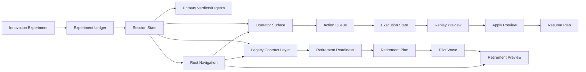

# Imitation Commercial Agent Ops Closed Loop / 仿写商业 Agent 运营闭环架构（2026-05-09）

这份文档不是再重复全量控制层，而是专门从**商业运营闭环**视角解释：

- 当前系统怎么从 experiment 走到 operator surface
- 怎么进入 action / execution / replay / resume
- 怎么进入 legacy 治理与 retirement 预演
- 为什么这已经不是 demo，而是在接近商业可运营控制层

---

## 1. 商业运营闭环总图

---

## 2. 运营闭环拆解

### 2.1 发现阶段：Experiment -> Ledger

这一步对应“发现机会”：

- 哪些创新值得推
- 哪些风险需要压
- 哪些实验只是局部 pilot

核心产物：

- `writer-innovation-experiment-*.json`
- Experiment Ledger

运营意义：

- 不是看一堆散乱试验，而是看“当前 session 的机会池”

---

### 2.2 判断阶段：Session State -> Operator Surface

这一步对应“形成可操作判断”：

- 当前状态是什么
- 当前 ready / blocked 是什么
- 当前 ship decision 是什么

核心产物：

- `writer-imitate-session-state.json`
- `writer-imitate-operator-surface.json`

运营意义：

- 给控制台一个默认首页
- 给运营/业务一个不必下钻全量字段也能看懂的第一层入口

---

### 2.3 执行阶段：Action -> Execution

这一步对应“真正往前推”：

- 下一步该做什么
- 谁负责
- 哪些 ticket ready
- 哪些 ticket 还 blocked

核心产物：

- `writer-imitate-action-queue.*`
- `writer-imitate-execution-state.*`

运营意义：

- 从“看状态”切到“推动作”
- 从“看摘要”切到“看执行”

---

### 2.4 安全推进阶段：Replay -> Apply -> Resume

这一步对应“先预演，再落地，再续跑”：

核心产物：

- `writer-imitate-execution-replay.*`
- `writer-imitate-execution-apply.*`
- `writer-imitate-execution-resume.*`

运营意义：

- 不是直接拍脑袋执行
- 而是先看：
  - 会推进哪些 ticket
  - 会改哪些 checkpoint
  - 如果出问题如何 resume

---

### 2.5 兼容治理阶段：Primary vs Legacy

这一步对应“控制层本身的迁移治理”：

核心对象：

- `session_primary_verdicts`
- `session_primary_digests`
- `session_primary_contract_hints`
- `session_legacy_contract_layer`

运营意义：

- 主入口与兼容层分开
- 新消费者认 primary
- 老消费者还能继续走 legacy

---

### 2.6 退休治理阶段：Readiness -> Plan -> Pilot Wave -> Preview

这一步对应“真正开始收掉旧字段前的商业级治理”：

核心对象：

- `session_legacy_retirement_readiness`
- `session_legacy_retirement_plan`
- `session_legacy_retirement_pilot_wave`
- `writer-imitate-legacy-retirement-preview.*`

运营意义：

- 不是一拍脑袋删旧字段
- 而是先确认：
  - 现在能不能退
  - 先退哪一小波
  - 出问题怎么回滚

---

## 3. 当前商业运营闭环已经具备的能力

### 已具备

1. **机会发现**
   - experiment / ledger
2. **一层判断**
   - operator surface
3. **动作编排**
   - action queue / execution state
4. **安全推进**
   - replay / apply / resume
5. **兼容治理**
   - primary vs legacy
6. **退休预演**
   - readiness / plan / pilot wave / preview

---

## 4. 仍未完全闭环的地方

### 4.1 还没有 live mutation

当前 apply 还是 preview，不是真正 live writeback。

### 4.2 还没有 consumer migration telemetry

现在知道该迁什么，但还没接“哪些下游已迁到 primary”的真实统计。

### 4.3 还没有 automated retirement gate

readiness / plan 已有，但还没有真正自动阻止不满足条件的 retirement patch。

### 4.4 还没有完整 control console

合同与产物已经在位，但 UI/control console 还没 fully 接上。

---

## 5. 为什么这已经不是 demo

如果是 demo，通常只会有：

- 一份 report
- 一份 summary
- 一些漂亮字段

而当前系统已经有：

- session state
- operator surface
- action queue
- execution state
- replay/apply/resume
- primary/legacy 双层
- retirement governance
- root navigation

这说明它已经在向**商业化控制层 / 编排层 / 治理层**演进，而不是停在“展示概念”。

---

## 6. 推荐和哪几份文档一起看

1. `docs/architecture/imitation-commercial-agent-control-plane-architecture-20260509.md`
2. `docs/imitation-control-plane-glossary.md`
3. `docs/writer-imitation-workflow.md`
4. `docs/batch-innovation-experiment-workflow.md`
5. `docs/imitation-next-dev-handoff.md`

---

## 7. 一句话总结

> 当前仿写商业 Agent 控制层，已经初步形成“发现机会 -> 做出判断 -> 推动作 -> 安全推进 -> 治理兼容层 -> 预演退休旧字段”的运营闭环，只差 live mutation、consumer telemetry 和 automated gate，才会进入真正完整的商业闭环。
