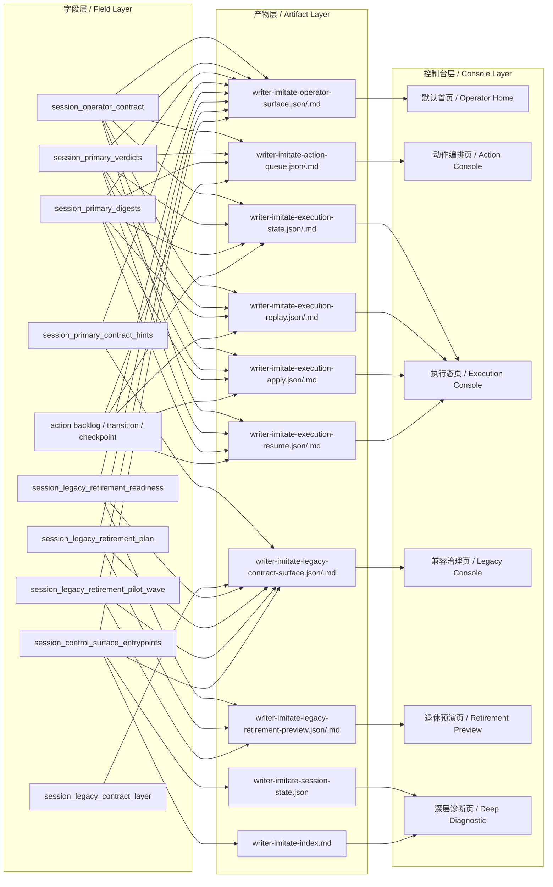

# Imitation Control-Plane Field → Artifact → Console Map / 仿写控制层 字段层→产物层→控制台层 映射图（2026-05-09）

这份文档专门回答一个非常接入侧的问题：

> 某一类字段，最后会落到哪个产物里？  
> 哪个产物应该给控制台哪一层消费？

它适合：

- 产品
- 运营
- 前端
- 控制台接入方
- 后续做字段瘦身/展示层治理的人

---

## 1. 三层映射总图

---

## 2. 三层含义

### 2.1 字段层

字段层回答的是：

- 我们到底在治理什么信号？
- 哪些字段属于 primary？
- 哪些字段属于 legacy？
- 哪些字段属于 retirement 预备治理？

这一层更偏“模型/协议层”。

---

### 2.2 产物层

产物层回答的是：

- 这些字段到底落在哪些 json / markdown 里？
- 是默认入口产物，还是深层产物？

这一层更偏“交付物/接口层”。

---

### 2.3 控制台层

控制台层回答的是：

- 控制台首页应该读哪个产物？
- 动作页应该看 action queue 还是 execution state？
- legacy 治理应该看哪个 surface？

这一层更偏“最终使用面”。

---

## 3. 当前推荐映射

### 3.1 默认首页 / Operator Home

推荐读取：

- `writer-imitate-operator-surface.json`

原因：

- 已经收口第一层状态、队列、owner、primary verdict/digest
- 不需要先读更大的 session-state

---

### 3.2 动作编排页 / Action Console

推荐读取：

- `writer-imitate-action-queue.json`

重点字段：

- `session_operator_contract`
- `session_primary_verdicts`
- `session_primary_digests`
- action backlog
- transition queue
- checkpoint mutations

---

### 3.3 执行态页 / Execution Console

推荐读取：

- `writer-imitate-execution-state.json`
- `writer-imitate-execution-replay.json`
- `writer-imitate-execution-apply.json`
- `writer-imitate-execution-resume.json`

原因：

- 这几层共同回答“现在会怎么执行 / 怎么 apply / 怎么 resume”

---

### 3.4 兼容治理页 / Legacy Console

推荐读取：

- `writer-imitate-legacy-contract-surface.json`

原因：

- 专门聚焦 legacy family
- 不污染 primary 首页

---

### 3.5 退休预演页 / Retirement Preview

推荐读取：

- `writer-imitate-legacy-retirement-preview.json`

原因：

- readiness / plan / pilot wave / projected effect 已被收在一个面里

---

### 3.6 深层诊断页 / Deep Diagnostic

推荐读取：

- `writer-imitate-session-state.json`
- `writer-imitate-index.md`

原因：

- 这些仍然保留最全信息
- 更适合排障、审计、深层对照

---

## 4. 当前控制台接入建议

如果今天就要接一个最小控制台，建议这样分：

### 首页
- 直接读 `writer-imitate-operator-surface.json`

### 动作页
- 读 `writer-imitate-action-queue.json`

### 执行页
- 读 `writer-imitate-execution-state.json`
- 切页读 replay/apply/resume

### 兼容治理页
- 读 `writer-imitate-legacy-contract-surface.json`

### 退休试探页
- 读 `writer-imitate-legacy-retirement-preview.json`

---

## 5. 这张图解决什么问题

它主要解决 4 个问题：

1. **字段太多时，不知道落到哪个产物**
2. **产物太多时，不知道控制台该先接哪个**
3. **primary / legacy / retirement 三条线容易混在一起**
4. **后续做字段瘦身时，不知道会影响哪一层**

---

## 6. 当前仍然没闭环的地方

虽然三层映射已经比较清晰，但还没 fully closed-loop：

- live mutation 还没真正落地
- consumer telemetry 还没接
- automated gate 还没接
- 完整控制台 UI 还没 fully assembled

也就是说：

这张图更像是**商业 Agent 控制层接入蓝图**，而不是已经 fully shipped 的最终界面实现图。

---

## 7. 推荐与哪些文档一起看

1. `docs/architecture/imitation-commercial-agent-control-plane-architecture-20260509.md`
2. `docs/architecture/imitation-commercial-agent-ops-closed-loop-20260509.md`
3. `docs/architecture/imitation-control-plane-implementation-status-map-20260509.md`
4. `docs/imitation-control-plane-glossary.md`

---

## 8. 一句话总结

> 这张图把“字段层、产物层、控制台层”三者的关系第一次明确连起来，使当前仿写商业 Agent 控制层不仅有结构、有闭环，还有可接入的消费映射。
