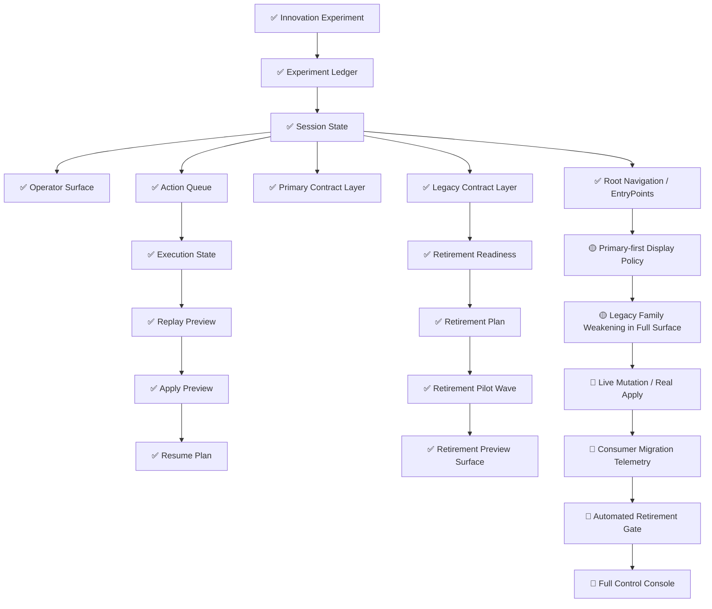

# Imitation Control-Plane Implementation Status Map / 仿写控制层实现状态图（2026-05-09）

这份文档专门回答一个非常实际的问题：

> 当前控制层里，哪些能力已经落地，哪些只是规划中的目标，哪些还明显没做完？

它不是替代完整架构图，而是给出一个**状态视图**。

---

## 1. 状态图例

- `✅ 已实现`：代码/产物/合同已存在，并已有测试或验证链支持
- `🟡 预演/过渡中`：已有结构化对象或 preview surface，但还没 fully live
- `🔴 未实现/未闭环`：方向已明确，但还缺实际执行闭环

---

## 2. 当前实现状态总图

---

## 3. 已实现能力

### 3.1 Experiment / Session / Operator 基础面

已实现：

- innovation experiment artifact
- experiment ledger
- session-state
- operator-surface

说明：

这部分已经把“试验结果”提升成“可操作 session 状态”，不再只是 demo 报告。

---

### 3.2 执行链 preview 面

已实现：

- action queue
- execution state
- replay preview
- apply preview
- resume plan

说明：

这意味着控制链已经具备：

- 看下一步动作
- 预演执行
- 看 apply 结果
- 看 resume 路径

但注意：这里仍主要是 preview / plan，不是 live mutation。

---

### 3.3 Primary / Legacy 双层治理

已实现：

- `session_primary_verdicts`
- `session_primary_digests`
- `session_primary_contract_hints`
- `session_legacy_contract_layer`
- standalone primary surface
- standalone legacy surface

说明：

这已经是一个非常明确的商业控制层治理结构，不只是字段堆叠。

---

### 3.4 Retirement 预备治理

已实现：

- readiness
- retirement plan
- pilot wave
- retirement preview surface

说明：

这意味着“删除旧字段”这件事已经被治理化，而不是 ad hoc 改动。

---

## 4. 预演/过渡中能力

### 4.1 Primary-first Display Policy

当前状态：`🟡`

已实现的部分：

- `display_policy=primary-first-legacy-secondary`
- primary verdict/digest 已前置显示
- legacy layer 已显式弱化

未完全闭环的部分：

- 还没有真正 UI/control console 严格按此策略渲染

---

### 4.2 Legacy Family Weakening

当前状态：`🟡`

已实现的部分：

- legacy family 已被独立 surface 收口
- full surface 中已被单独归类

未完全闭环的部分：

- 旧字段仍大量保留
- 还没有真正开始第一批 live retirement patch

---

## 5. 未实现/未闭环能力

### 5.1 Live Mutation / Real Apply

当前状态：`🔴`

缺的不是 preview，而是真正：

- 执行 checkpoint writeback
- 真实状态迁移
- 真实 apply side effects

---

### 5.2 Consumer Migration Telemetry

当前状态：`🔴`

目前还缺：

- 哪些消费者已迁到 primary
- 哪些消费者仍依赖 legacy
- migration progress 仪表

---

### 5.3 Automated Retirement Gate

当前状态：`🔴`

目前有：

- readiness
- plan
- pilot wave

但还缺：

- 自动阻止不满足条件的 retirement patch
- 自动校验 migration completeness

---

### 5.4 Full Control Console

当前状态：`🔴`

目前已经有非常完整的合同与产物面，
但还没有一个 fully assembled 的商用控制台把这些层整合成统一操作界面。

---

## 6. 当前最先进的点，不在于“能跑”，而在于“已被治理”

如果只从“系统先进性”看，当前真正值得强调的不是：

- 又多了多少字段
- 又多了多少 markdown

而是：

### 已经开始把控制层本身当作治理对象

包括：

- primary/legacy 双层
- root navigation
- display policy
- retirement readiness
- retirement plan
- pilot wave
- retirement preview

这说明当前系统正在从“工程输出”向“商业控制层制度化”演进。

---

## 7. 推荐结合哪些文档一起看

1. `docs/architecture/imitation-commercial-agent-control-plane-architecture-20260509.md`
2. `docs/architecture/imitation-commercial-agent-ops-closed-loop-20260509.md`
3. `docs/imitation-control-plane-glossary.md`

---

## 8. 一句话总结

> 当前仿写商业 Agent 控制层已经把“状态、执行、兼容、退休”四类能力全部结构化，但离真正 fully commercial-closed-loop 还差 live mutation、migration telemetry、automated gate 与完整 control console。
