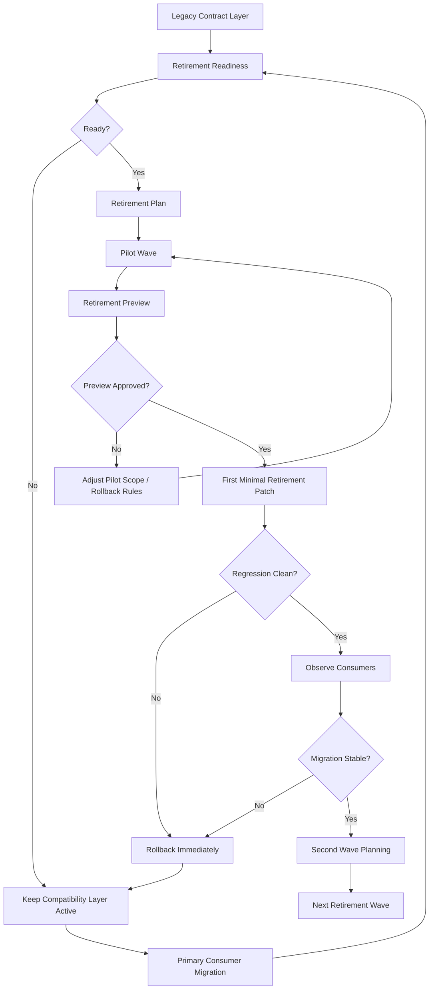

# Imitation Legacy Retirement Roadmap / 仿写控制层 Legacy Retirement 路线图（2026-05-09）

这份文档专门解释：

> 从当前 primary/legacy 双层治理，如何安全走到第一次真正的 legacy 字段 retirement patch？

它不重复完整控制层，而是只关注：

- readiness
- plan
- pilot wave
- preview
- rollback
- 后续 wave 扩展

---

## 1. Legacy Retirement 路线图总览



---

## 2. 当前每一步在我们系统中的对应对象

### 2.1 Legacy Contract Layer

对应：

- `session_legacy_contract_layer`
- `writer-imitate-legacy-contract-surface.json/.md`

作用：

- 把旧 verdict/digest 家族统一收口成一个被管理对象

---

### 2.2 Retirement Readiness

对应：

- `session_legacy_retirement_readiness`

作用：

- 明确现在为什么还不能退
- 明确真正 retirement 前需要满足哪些条件

---

### 2.3 Retirement Plan

对应：

- `session_legacy_retirement_plan`

作用：

- 给出整体 retirement 顺序
- 区分 pilot candidates 和 second wave candidates

---

### 2.4 Pilot Wave

对应：

- `session_legacy_retirement_pilot_wave`

作用：

- 把第一次最小试探波次单独对象化
- 明确：
  - wave id
  - target family
  - target fields
  - rollback rule

---

### 2.5 Retirement Preview

对应：

- `writer-imitate-legacy-retirement-preview.json/.md`

作用：

- 在真正动 live 字段前，先单独预演：
  - readiness
  - pilot wave
  - projected effect

---

## 3. 当前路线所处位置

如果用这张路线图看当前进度，我们现在大致处于：

```text
Legacy Contract Layer ✅
Retirement Readiness ✅
Retirement Plan ✅
Pilot Wave ✅
Retirement Preview ✅
First Minimal Retirement Patch ❌（还未真正开始）
```

也就是说：

当前已经把**第一批 retirement patch 前的制度准备**做得比较完整，
但还没有进入真正执行删除/收缩旧字段的 live 阶段。

---

## 4. 当前最适合做 first-wave 的对象

按当前设计，最适合 first-wave 的是：

- `session_governance_checksum_v2`
- `session_operating_checksum`

原因：

1. 它们属于 digest/checksum family
2. 比 verdict family 风险低
3. 对 primary 层替代路径更清晰
4. 更适合作为最小试探切口

---

## 5. 为什么不先动 verdict family

因为 verdict family 更接近：

- 业务判断
- operator 理解
- 执行状态认知

一旦过早动 verdict：

- 容易影响控制台首页
- 容易影响消费者判断逻辑
- 容易造成 migration 噪音

所以更合理的顺序是：

1. 先 digest / checksum 变体
2. 再更敏感的 verdict 变体

---

## 6. first-wave 执行时最关键的三条纪律

### 6.1 只收一个很小的 family slice

不要一次退多个概念层。

### 6.2 preview 永远先于 live patch

先看 `legacy-retirement-preview`，再决定是否进 live patch。

### 6.3 一旦 mismatch 立刻 rollback

不允许带着消费者不兼容状态继续推进。

---

## 7. 什么时候算可以进入 second wave

至少要满足：

1. first-wave patch regression 干净
2. primary consumer 路径稳定
3. legacy fallback 没被误删
4. operator 没有因为 first-wave 失去判断能力

只有满足这些条件，才适合推进 second wave。

---

## 8. 当前最大的风险点

### 8.1 我们已经有很多治理对象，但还没有 live mutation

也就是说：

- 结构准备很充分
- 真正执行仍未 fully close

### 8.2 consumer migration telemetry 还没接

我们知道应该迁，
但还没有真实统计：

- 谁已经迁了
- 谁还没迁

### 8.3 automated retirement gate 还没接

所以目前还是偏“制度化手工治理”，还不是 fully automated。

---

## 9. 推荐和哪些文档一起看

1. `docs/architecture/imitation-commercial-agent-control-plane-architecture-20260509.md`
2. `docs/architecture/imitation-control-plane-implementation-status-map-20260509.md`
3. `docs/architecture/imitation-control-plane-field-artifact-console-map-20260509.md`
4. `docs/imitation-control-plane-glossary.md`

---

## 10. 一句话总结

> 当前系统已经把 legacy 字段 retirement 从“以后再说”推进成“readiness -> plan -> pilot wave -> preview”的结构化治理路径，下一步真正的挑战不再是想法，而是第一次最小 live retirement patch 的安全落地。
