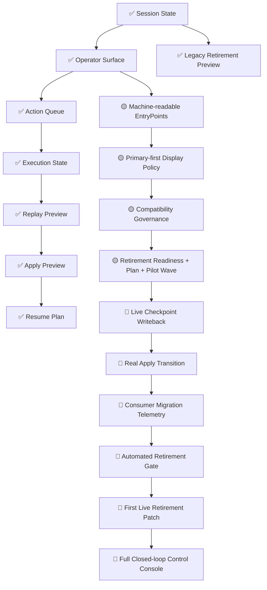

# Imitation Live Mutation Bridge Roadmap / 仿写控制层 从当前到最小 Live Mutation 的路线图（2026-05-09）

这份文档专门回答：

> 从我们当前已经做好的 preview / governance / retirement 结构，  
> 到第一次真正的 live mutation / apply / retirement patch，  
> 中间还差哪几步？

它不是完整架构图，而是一张“从现在到下一步真实执行”的桥接图。

---

## 1. Bridge 路线图总览

---

## 2. 当前已经具备什么

### 2.1 预演式控制链

当前已经有：

- session state
- operator surface
- action queue
- execution state
- replay preview
- apply preview
- resume plan

说明：

这意味着“下一步动作如何判断、如何预演、如何恢复”已经有完整 preview 面。

---

### 2.2 治理式兼容迁移链

当前已经有：

- primary / legacy 双入口
- primary contract hints
- legacy contract layer
- retirement readiness
- retirement plan
- retirement pilot wave
- retirement preview

说明：

这意味着“旧字段如何治理”已经不是口头约定，而是结构化治理对象。

---

## 3. 当前还缺的，不是更多 preview，而是 live bridge

### 3.1 Live Checkpoint Writeback

当前状态：`🔴`

还缺：

- 真正把 preview 中的 checkpoint mutation 写回状态
- 真正把 execution state 从 preview 变成 live state transition

这是从“可预演”到“可执行”的第一道桥。

---

### 3.2 Real Apply Transition

当前状态：`🔴`

还缺：

- apply 不再只是 markdown/json preview
- 而是触发真实 mutation / state change

这是从“看起来能推进”到“真的推进了”的第二道桥。

---

### 3.3 Consumer Migration Telemetry

当前状态：`🔴`

还缺：

- 哪些消费者已迁到 primary
- 哪些消费者仍依赖 legacy
- migration progress 可视化统计

这是从“理论上能迁”到“实际知道谁迁没迁”的第三道桥。

---

### 3.4 Automated Retirement Gate

当前状态：`🔴`

还缺：

- 不满足 readiness 就禁止 retirement patch
- 不满足 migration completeness 就禁止删 legacy family

这是从“人工纪律”到“系统自动守门”的第四道桥。

---

### 3.5 First Live Retirement Patch

当前状态：`🔴`

这一步的前提必须是：

1. preview 已评审
2. migration telemetry 可见
3. automated gate 存在
4. rollback path 可执行

否则就不是真正商业化控制层，而只是实验性清理。

---

## 4. 当前最合理的最小 live mutation 顺序

推荐顺序：

### Phase A：先做 live checkpoint writeback

目标：

- 让 `session_checkpoint_mutations` 真正落地

为什么先做：

- 比直接 retirement 字段安全
- 先把 mutation 桥搭好，后面 retirement 才能不靠“假想执行”

---

### Phase B：再做 live apply transition

目标：

- 让 apply 不再只是 preview
- 让 action -> execution -> apply 有真实状态推进

---

### Phase C：补 consumer migration telemetry

目标：

- 知道谁已经迁到 primary
- 谁仍依赖 legacy

---

### Phase D：补 automated retirement gate

目标：

- 让系统自动阻止 premature retirement

---

### Phase E：最后再做 first live retirement patch

目标：

- 只退最小 digest/checksum family slice
- 先从 `pilot_wave` 指定的低风险对象开始

---

## 5. 为什么现在还不能直接做 live retirement

因为当前还缺三个关键环节：

1. **live mutation**
2. **migration telemetry**
3. **automated gate**

没有这三者，直接 live retirement 风险太高。

所以当前最合理路径不是：

- “已经有 plan，就直接删”

而是：

- “先把 live bridge 搭起来，再删”

---

## 6. 这张图对团队的意义

这张图的价值在于：

### 对产品/运营

知道：

- 当前已经不是 demo
- 但也还没有 fully closed-loop

### 对前端/控制台

知道：

- 现在可以安全接 preview 面
- 未来 live mutation 接口该往哪演进

### 对后端/控制层开发

知道：

- 下一步最值得做的不是再堆字段
- 而是把 preview -> live bridge 真正补上

---

## 7. 推荐和哪些图一起看

1. `docs/architecture/imitation-commercial-agent-control-plane-architecture-20260509.md`
2. `docs/architecture/imitation-commercial-agent-ops-closed-loop-20260509.md`
3. `docs/architecture/imitation-control-plane-implementation-status-map-20260509.md`
4. `docs/architecture/imitation-control-plane-field-artifact-console-map-20260509.md`
5. `docs/architecture/imitation-legacy-retirement-roadmap-20260509.md`

---

## 8. 一句话总结

> 当前系统最缺的已经不是更多 contract，而是把 preview/governance 结构真正桥接到 live mutation / apply / retirement gate；这张图就是那条桥的路线图。
