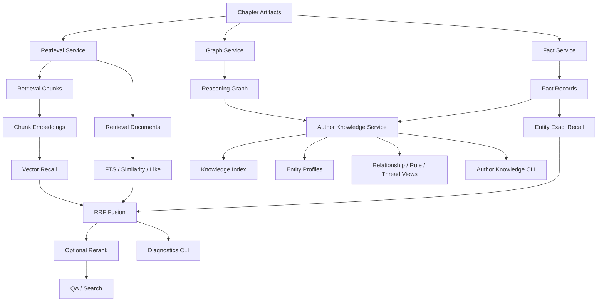

# Independent Agent Knowledge & Retrieval Architecture

## 1. 目标
这条能力线的目标不是绑定某个 agentOS，而是沉淀可抽离、可复用的底层能力：
- retrieval recall / rerank / diagnostics
- author-facing knowledge pack / control surface
- branch-level knowledge reuse for future independent agents or OpenClaw-style runtimes

## 2. 架构图

## 3. 当前能力
- retrieval 已具备：`fts` / `similarity` / `like` / `keyword` / `entity_exact` / `vector`
- diagnostics 已具备：raw/reranked/route/latency 可见性
- author knowledge 已具备：chapter cards、knowledge index、entity profiles、relationship/rule/thread 聚合

## 4. 设计原则
1. retrieval 与 author knowledge 都是 **domain capability**，不是平台绑定能力。
2. 风险门控主判断仍独立，不直接被 QA retrieval rerank 接管。
3. author knowledge 是未来独立 agent / OpenClaw 抽离的优先候选层。

## 5. 待办
- retrieval live route benchmark
- author knowledge 的人物/关系/规则更强摘要层
- whole-book / next-chapter 对 author knowledge 的更直接消费
