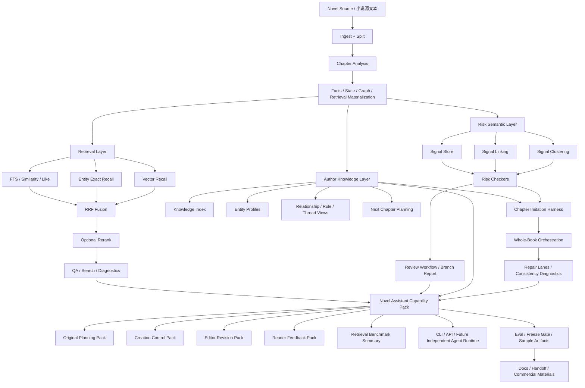
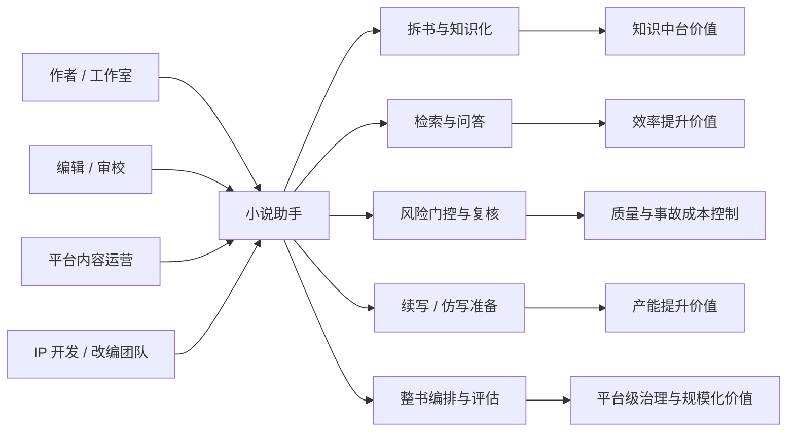

# Novel Assistant System Architecture / 小说助手系统架构

## 1. 目标
这个架构文档描述的是“可商业化小说助手”整体能力，不是单个模块。
它强调三点：
- 能力必须独立、可维护、可抽离
- 主链必须可验证、可交接、可运营
- 生成能力必须建立在知识层与门控层之上

## 2. 技术架构图

## 3. 业务架构图

## 4. 核心设计原则
1. **知识先于生成**：先理解，再写。
2. **门控先于放量**：先可控，再规模化。
3. **能力独立可抽离**：不把系统价值绑在某个外部 agentOS 上。
4. **样例/交付可追踪**：任何关键能力都要有 sample、checkout、handoff、smoke path。

## 5. 当前最重要的未闭环项
- original planning pack 继续前推到卷纲 / 人物成长弧 / story bible
- editor revision / reader feedback pack 接入真实 draft 与真实评论
- whole-book 多 provider 成功样例密度
- 风险语义层的长窗口质量评估
