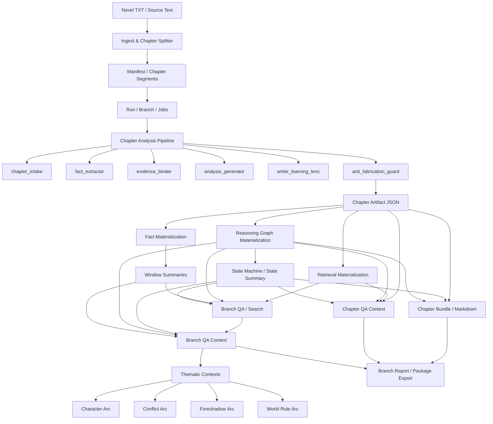

# Final Handoff / 交付清单

本文件用于当前拆书 agent 的阶段性交付说明，供继续开发、前端接入、下游 agent 使用、或后续维护者快速接手。

---

## 1. 当前系统定位

这是一个 **拆书 agent**，不是写作 agent。

核心目标：
- 按章节推进拆书
- 可恢复、可回退、可重拆
- 输出事实层、推理图、状态摘要、问答上下文
- 为写作者/问答工具/前端工作台提供可消费的结构化结果

不承担：
- 直接代写小说正文
- 无证据剧情扩写
- 脱离章节文本的自由推断

---

## 1.1 架构总览



### 阅读说明
1. 输入层：原始文本进入导入与切章。
2. 分析层：按章节进入 staged agent pipeline。
3. 派生层：生成 retrieval / facts / graph / window / state summary。
4. 消费层：输出 bundle / markdown / QA context / thematic contexts / package。

## 2. 已支持能力总览

### 2.1 拆书主链路
- 小说导入与章节切分
- run / branch 管理
- 单章推进 / 区间推进 / 串行恢复
- fallback monolithic 分析

### 2.2 结构化分析输出
- chapter summary
- key entities / key events
- continuity notes
- state transition notes
- evidence-backed resolutions
- unresolved threads
- writer learning notes

### 2.3 派生层
- retrieval documents
- facts
- 5 章窗口总结
- reasoning graph
- state machine
- state summary

### 2.4 问答层
- branch QA
- chapter QA context
- branch QA context
- recommended questions
- query hints
- thematic contexts

### 2.5 专题导航层
- character arc
- conflict arc
- foreshadow arc
- world rule arc

### 2.6 专题证据链层
- reasoning paths
- state signals
- supporting facts
- node refs
- edge refs
- timeline points

### 2.7 运维与恢复
- failed job 查询
- running job 清理
- 单章重试 / 批量失败重试
- branch validate / repair
- fork branch 逻辑回退
- 同 branch 同章重拆兼容

### 2.8 Web 工作台原型
- 独立前端目录：`apps/web/`
- 独立后端目录：`apps/api/`
- 前端可读取真实 run / branch snapshot
- 可按章节查看 chapter bundle / QA context / 原始正文
- 支持从拆书引用中的 `第N章` 跳转查看对应章节
- 支持恢复动作与导出链接生成

### 2.8.1 当前基础 release 已覆盖的工作台能力
- `/library`：多本小说管理入口、当前生效小说切换、状态总览
- `/control`：导入作品、查看进度、继续整理、显示异常提示
- `/reader`：查看章节拆书细节、状态信息与原始章节正文
- `/qa`：聊天式问答、流式输出、检索联动问答、引用章节跳转、推理摘要展示
- `/ops`：恢复失败任务、处理运行态、生成导出资源
- 多任务运行 / 恢复中心：集中查看“运行中 / 待恢复”小说，并支持自动刷新
- 运行时文件默认写入 `.cache/novel-analyzer/`，并兼容历史 `.omx/...` 路径迁移
- 工作台会按 branch 记住各自的最后阅读章节，减少多本小说切换时的上下文丢失
- 可通过 `novel-analyzer runtime-storage --migrate` 或 `scripts/check_runtime_storage.py --migrate` 检查并迁移历史运行时文件
- `/library` 与任务中心已能直接读取 `runtime-health`，用于排查运行时文件问题
- `/library` 与任务中心现已同时显示 provider 健康状态，帮助识别 ask-stream 是否因上游 503 持续降级
- 任务中心会根据 provider 健康状态给出更明确的操作建议；问答页降级提示也已转为更产品化文案，而不是直接暴露原始错误串
- 工作台头部统一系统状态条已接入 provider/cache/自动刷新状态；恢复页也会结合 provider degraded 状态调整操作提示

结论：当前版本已经具备“真实可操作工作台”的基础能力，而不只是单纯原型页。

### 2.9 当前工作台产品化方向
- 控制台按“导入作品 / 查看进度 / 下一步建议”组织
- 章节阅读按“阅读提要 / 人物线索 / 追问推理 / 原文回看”组织
- 导出与恢复按“结果资源中心”组织，而不是技术调试台
- 当前界面目标用户是写作者，不强调技术字段暴露

### 2.10 当前推荐运行配置
- provider: `vip1129`
- base_url: `https://api.vip1129.cc/v1`
- model: `gpt-5.4-mini`

### 2.11 当前恢复策略
- 章节失败先自动重试
- 自动重试上限：**5 次**
- 超过 5 次后才进入人工恢复态

---

## 3. 关键命令清单

### 初始化
```bash
poetry run novel-analyzer init-db
poetry run novel-analyzer db-health
poetry run novel-analyzer test-embedding
```

### 导入与创建
```bash
poetry run novel-analyzer ingest /path/to/novel.txt --title '样例'
poetry run novel-analyzer start-run <novel_id> <manifest_id>
```

### 拆书推进
```bash
poetry run novel-analyzer analyze-next <run_id> <branch_id>
poetry run novel-analyzer analyze-range <run_id> <branch_id> 1 3
poetry run novel-analyzer resume-run <run_id> <branch_id> --max-chapters 3
```

### 状态 / 查看
```bash
poetry run novel-analyzer show-run-status <run_id> <branch_id>
poetry run novel-analyzer show-branch <branch_id>
poetry run novel-analyzer list-chapters <branch_id>
poetry run novel-analyzer show-chapter <branch_id> <chapter_index>
poetry run novel-analyzer show-context <branch_id> <chapter_index>
poetry run novel-analyzer show-raw-output <branch_id> <chapter_index>
```

### 图谱 / 状态机 / 审计
```bash
poetry run novel-analyzer summarize-graph <branch_id>
poetry run novel-analyzer show-graph <branch_id>
poetry run novel-analyzer show-reasoning-graph <branch_id>
poetry run novel-analyzer show-facts <branch_id> --chapter-index 1
poetry run novel-analyzer search-facts <branch_id> '卫图 命格'
poetry run novel-analyzer show-window <branch_id> 1 5
```

### 问答与上下文导出
```bash
poetry run novel-analyzer ask-branch <branch_id> '命格线如何推进？'
poetry run novel-analyzer export-chapter-qa-context <branch_id> <chapter_index> ./chapter-qa.json
poetry run novel-analyzer export-branch-qa-context <run_id> <branch_id> ./branch-qa.json
```

### 导出
```bash
poetry run novel-analyzer export-chapter-bundle <branch_id> <chapter_index> ./chapter.json
poetry run novel-analyzer export-branch-bundle <run_id> <branch_id> ./branch.json
poetry run novel-analyzer export-branch-report <run_id> <branch_id> ./branch.md
poetry run novel-analyzer export-branch-package <run_id> <branch_id> ./branch_pkg
```

### 恢复 / 修复 / 回退
```bash
poetry run novel-analyzer list-failed-jobs <branch_id>
poetry run novel-analyzer clear-running-jobs <branch_id>
poetry run novel-analyzer retry-chapter <run_id> <branch_id> <chapter_index>
poetry run novel-analyzer retry-failed-jobs <run_id> <branch_id>
poetry run novel-analyzer validate-branch <branch_id>
poetry run novel-analyzer repair-branch <branch_id>
poetry run novel-analyzer fork-branch <branch_id> <keep_through>
```

---

## 4. 稳定输出接口

> 开发约定：后续每次开发更改，都需要同步更新 [`../CHANGELOG.md`](../CHANGELOG.md)。

核心稳定输出面：
- chapter bundle
- branch bundle
- chapter QA context
- branch QA context
- thematic contexts

接口说明文档：
- [`./interface-manifest.md`](./interface-manifest.md)

样例 JSON：
- [`./examples/chapter-bundle.sample.json`](./examples/chapter-bundle.sample.json)
- [`./examples/branch-bundle.sample.json`](./examples/branch-bundle.sample.json)
- [`./examples/chapter-qa-context.sample.json`](./examples/chapter-qa-context.sample.json)
- [`./examples/branch-qa-context.sample.json`](./examples/branch-qa-context.sample.json)

操作手册：
- [`./cli-operations-manual.md`](./cli-operations-manual.md)

---

## 5. 推荐接入路径

### 前端工作台
建议直接消费：
1. `branch_qa_context.json`
2. `thematic_contexts`
3. `branch_report.md`
4. `chapter_XXXX.qa-context.json`
5. `chapter bundle`
6. 原始章节正文片段（通过 chapter segment offset / source text）

当前仓库内已经提供独立工作台原型：
- `apps/api/`
- `apps/web/`

可直接作为后续真实前端的演进起点。

### 写作者参考工具
建议优先使用：
1. `chapter_XXXX.md`
2. `chapter_XXXX.json`
3. `chapter_XXXX.qa-context.json`
4. `branch_report.md`
5. `branch_qa_context.json`

### 下游 agent
建议输入：
1. `branch_qa_context.json`
2. `thematic_contexts[topic]`
3. `chapter_output_summary`
4. `reasoning_graph`

---

## 6. 已重点解决的问题

- 同 branch 同章重拆会撞 checkpoint 唯一约束 → 已修复
- state summary 只导出不参与主流程 → 已回灌到分析 prompt
- anti-fabrication 未利用状态摘要 → 已接入 prompt + deterministic guard
- thematic contexts 只有问题无结构 → 已补导航、证据链、可视化结构
- 接口层只有 dict 无契约 → 已加 typed contract

---

## 7. 当前剩余风险 / 注意事项

### 7.1 外部 LLM 稳定性
仍然是最大风险点：
- relay 可能波动
- 某些模型可能 endpoint 可连通但服务端未加载成功

### 7.2 小模型稳定性仍依赖 prompt 约束
虽然现在已经显著增强，但仍建议：
- 串行推进
- 小批次跑
- 关键章节人工抽查

### 7.3 演示数据与真实长篇的差异
某些 thematic context 的 node refs / related chapters 在极简示例数据里可能偏少；真实长文本下价值更明显。

### 7.4 文档不是 JSON Schema 文件
当前提供的是：
- typed contract
- manifest docs
- sample JSON

如果后续要给外部团队长期接入，仍建议再补正式 JSON Schema 导出。

---

## 8. 推荐后续演进顺序

### P1
- 正式 JSON Schema 导出
- 对外接口版本号约定
- 前端消费适配示例

### P2
- thematic contexts 的专题排序与证据密度增强
- 问答 rerank / gate 模型接入优化
- branch 级多专题联动问答

### P3
- 更强的图谱可视化与专题时间线 UI
- 多书管理 / 多 branch 工作台

---

## 8.1 当前真实试跑评估

- [`./real-run-evaluation-1-12.md`](./real-run-evaluation-1-12.md)
- [`./stage-evaluation-1-12.md`](./stage-evaluation-1-12.md)
- [`./session-handoff-manual.md`](./session-handoff-manual.md)

## 9. 当前阶段结论

这个项目现在已经不是“拆书脚手架”，而是一个：

- 能拆
- 能恢复
- 能回退
- 能问答
- 能导出
- 能做专题导航
- 能做图谱/时间线可视化输入
- 有接口契约
- 有样例数据
- 有操作手册

的可交付拆书 agent 后端。


### 2.12 小说检索 / 问答工作台能力
- 前端已接入 branch 级人物/事件检索
- 前端已接入基于整本小说内容的问答
- 问答结果保留 `used_chapters`、`evidence`、`reasoning_paths`、`graph_signals`
- 引用章节在界面内可直接跳转

- Web 工作台导出链路已从临时 `/tmp` 目录收口到项目内 `.cache/novel-analyzer/runtime-exports/` 持久目录，减少链接失效。

- 控制台首页现在会显式提示 `DAILY_LIMIT_EXCEEDED` / `USAGE_LIMIT_EXCEEDED` 这类外部额度失败，并给出恢复入口。

- 工作台导入的小说原文文件已从临时目录迁移到 `.cache/novel-analyzer/uploads/` 持久保存，保证章节正文回看与引用跳转可持续使用。

- 问答与检索功能已从阅读页内嵌区域升级为单独的“小说问答”页面入口。

- 前端根路由 `/` 已改为直接渲染控制台页面，修复构建阶段 `PageNotFoundError` 类问题。
