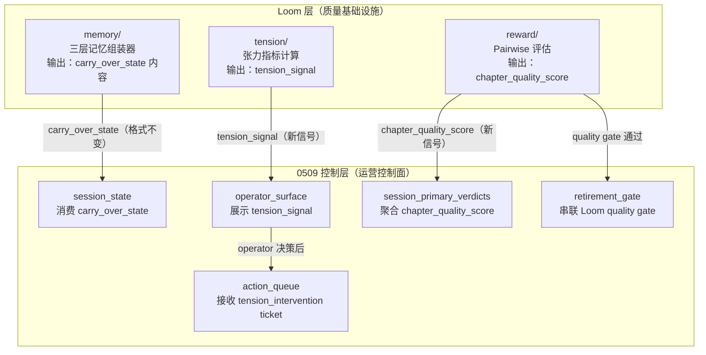

# Loom vs 0509 控制层：架构差异、冲突点与对齐方案

> 这份文档是 Loom 架构与 0509 仿写控制层之间的**精确对比文档**。
> 目标是回答三个问题：
> 1. 两套架构在哪些地方**有冲突**（不能同时成立）
> 2. 在哪些地方**有差异但不冲突**（各自独立，互不干扰）
> 3. 在哪些地方**应该对齐**（Loom 需要显式对接 0509）

---

## 1. 两套架构的核心定位

### 0509 控制层的定位

> 0509 是**仿写会话的运营控制面**。
> 它解决的问题是：一次仿写 session 里，实验结果如何被治理、如何被推进、如何被安全退休。

核心关注点：
- **横向**：一个 session 内多个 experiment 的编排与治理
- **时间轴**：experiment → session → operator → action → execution → replay/apply/resume
- **治理对象**：字段（primary/legacy）、动作（ticket/transition/checkpoint）、退休（retirement readiness/plan/pilot）

### Loom 的定位

> Loom 是**跨章节仿写的记忆与质量基础设施**。
> 它解决的问题是：多章节连续仿写时，记忆如何不退化、质量如何自进化、情节如何不平淡。

核心关注点：
- **纵向**：跨章节的记忆连贯性与冲突消解
- **时间轴**：chapter N → carry_over → chapter N+1 → ... → chapter N+k
- **治理对象**：记忆节点（GraphNode/FactRecord）、评估信号（pairwise pair）、张力指标（similarity/density/surprise）

---

## 2. 冲突点分析

### 冲突点 1：`carry_over_state` 的所有权

**0509 的做法**：
`carry_over_state` 是 `session_state` 的一部分，由 `writer-imitate-session-state.json` 管理，
通过 `session_control_loop` 在 action/execution 链路中流转。

**Loom 的做法**：
Loom memory 层要把 `carry_over_state` 替换为三层记忆结构（Working/Episodic/Semantic），
由 `memory_consolidation_service` 在每章完成后运行。

**冲突性质**：⚠️ **潜在冲突** — 两者都想"管"carry_over_state，但管理方式不同。

**解决方案**：
```
0509 session_state 继续作为 carry_over_state 的"运行时容器"（不变）
Loom memory 层作为 carry_over_state 的"组装器"（新增）

具体分工：
- Loom memory 层负责：从三层记忆动态组装出 carry_over_state 的内容
- 0509 session_state 负责：把组装好的 carry_over_state 放入 session 流转
- 接口：Loom 输出标准 carry_over_state JSON，0509 直接消费，格式不变
```

**结论**：不冲突，Loom 是 0509 的上游供应商，0509 是 Loom 的下游消费者。

---

### 冲突点 2：`verdict` / `quality_gate` 的判断权

**0509 的做法**：
`session_primary_verdicts` 是 session 级的主判断，由 operator contract 层收口，
`final_verdict` 决定 ship/hold/de-risk/pilot。

**Loom 的做法**：
Loom reward 层要引入 pairwise reward model，对生成质量做 A vs B 的比较判断，
输出 `quality_score` 和 `preference_verdict`。

**冲突性质**：⚠️ **潜在冲突** — 两者都在做"verdict"，但粒度和目的不同。

**解决方案**：
```
0509 primary_verdicts：session 级，回答"这个 session 整体该 ship 还是 hold"
Loom reward verdict：chapter 级，回答"这章草案 A 比草案 B 好在哪里"

具体分工：
- Loom reward 输出：chapter_quality_score + pairwise_preference（章节粒度）
- 0509 session_primary_verdicts 消费：把 chapter_quality_score 聚合为 session 级信号
- 接口：Loom reward 结果作为 session_primary_verdicts 的输入信号之一
```

**结论**：不冲突，粒度不同，Loom 是 0509 verdict 的输入信号来源之一。

---

### 冲突点 3：`retirement gate` 的触发条件

**0509 的做法**：
`session_legacy_retirement_readiness` 判断 legacy 字段是否可以退休，
条件是"primary 消费者迁移完成 + 无回归"。

**Loom 的做法**：
Loom reward 层的 automated gate 判断"质量是否达标才允许推进"，
条件是"pairwise 评估通过 + 张力指标达标"。

**冲突性质**：✅ **无冲突** — 两个 gate 的触发条件完全不同，可以串联。

**对齐方案**：
```
Loom quality gate（章节质量）→ 通过后 → 0509 retirement gate（字段治理）

即：先确认生成质量达标，再考虑字段退休。
两个 gate 串联，不互相替代。
```

---

### 冲突点 4：`action_queue` 的动作来源

**0509 的做法**：
`writer-imitate-action-queue.json` 的 ticket 来自 experiment ledger，
由 operator 手动或半自动推进。

**Loom 的做法**：
Loom tension 层的 obstacle injection 会在张力不足时自动触发修改动作，
这些动作需要进入某种队列。

**冲突性质**：⚠️ **潜在冲突** — Loom 的自动触发动作和 0509 的手动 action queue 可能产生竞争。

**解决方案**：
```
Loom tension 层输出：tension_alert（张力不足警告）+ obstacle_suggestion（建议注入的障碍类型）
0509 action_queue 消费：把 tension_alert 作为一类新 ticket 类型（tension_intervention）
操作权仍在 operator 手中，Loom 只提供信号，不直接写入 action_queue

接口：Loom 输出标准 tension_signal JSON，0509 operator surface 展示，operator 决定是否创建 ticket
```

**结论**：不冲突，Loom 是信号提供者，0509 operator 是决策者。

---

## 3. 差异点分析（不冲突，但需要明确边界）

### 差异点 1：时间轴方向不同

| 维度 | 0509 控制层 | Loom |
|------|-----------|------|
| 时间轴 | 横向：一个 session 内的 experiment 编排 | 纵向：跨章节的记忆连贯性 |
| 最小单元 | experiment ticket | chapter |
| 状态载体 | `session_state.json`（文件） | `GraphNode/FactRecord`（DB） |
| 持久化方式 | JSON 文件产物 | PostgreSQL 表 |
| 治理对象 | 字段（primary/legacy）、动作（ticket） | 记忆节点、评估信号、张力指标 |

**结论**：两者正交，不冲突。0509 管"这次 session 怎么跑"，Loom 管"跨章节记忆怎么不退化"。

---

### 差异点 2：状态持久化方式不同

**0509**：状态存在 JSON 文件（`writer-imitate-session-state.json` 等），适合 session 级快照，人可读。

**Loom**：状态存在 PostgreSQL（`graph_nodes`、`fact_records` 等），适合跨章节查询、向量检索、冲突检测。

**潜在问题**：两套状态可能出现不一致（JSON 文件 vs DB 记录）。

**对齐方案**：
```
明确单一真相来源（Single Source of Truth）：
- 章节级记忆状态：PostgreSQL（Loom 管）
- session 级运营状态：JSON 文件（0509 管）
- 两者通过 carry_over_state 接口同步，不直接互相读写
```

---

### 差异点 3：评估粒度不同

**0509**：session 级 verdict（`session_primary_verdicts`），回答"整个 session 该怎么处理"。

**Loom**：chapter 级 pairwise（`chapter_quality_score`），回答"这章草案哪个更好"。

**对齐方案**：
```
Loom chapter 级评估 → 聚合 → 0509 session 级 verdict

聚合规则：
- 连续 N 章 quality_score 低于阈值 → session_primary_verdicts 标记 hold
- 连续 N 章 tension_alert 触发 → session_primary_verdicts 标记 de-risk
```

---

### 差异点 4：对"仿写"的理解层次不同

**0509**：把仿写当作**商业运营对象**，关注 experiment 的 promote/de-risk/pilot/hold 决策。

**Loom**：把仿写当作**生成质量问题**，关注记忆连贯性、情节张力、评估自进化。

**结论**：两者互补，不冲突。0509 是"怎么运营仿写"，Loom 是"怎么让仿写质量更好"。

---

## 4. 对齐方案总图



---

## 5. 开发顺序建议（避免冲突）

### 原则

> **先做接口约定，再做实现。**
> Loom 和 0509 的对接点（carry_over_state、chapter_quality_score、tension_signal）
> 必须先定义好接口格式，再分别实现，避免实现时互相等待。

### 建议顺序

```
Step 1：定义三个接口格式（1天）
  - carry_over_state 的标准 JSON schema（Loom memory 输出，0509 消费）
  - chapter_quality_score 的标准格式（Loom reward 输出，0509 聚合）
  - tension_signal 的标准格式（Loom tension 输出，0509 展示）

Step 2：Loom Phase 1 实现（2-3周）
  - 三层记忆组装器（不改 0509，只改 carry_over_state 的生成方式）
  - 冲突代谢机制（只写 DB，不改 JSON 文件）

Step 3：0509 接口对接（1周）
  - session_state 消费新的 carry_over_state（格式兼容，内容更好）
  - operator_surface 展示 tension_signal（新增字段，不改现有字段）
  - session_primary_verdicts 聚合 chapter_quality_score（新增输入信号）

Step 4：Loom Phase 2 实现（2-3周）
  - Pairwise 评估框架
  - 张力指标计算
  - 接入 0509 retirement gate
```

---

## 6. 风险登记

| 风险 | 严重度 | 触发条件 | 缓解措施 |
|------|--------|---------|---------|
| carry_over_state 格式不兼容 | 🔴 高 | Loom 改了格式，0509 解析失败 | 先定义 schema，加版本号，向后兼容 |
| 两套 verdict 语义混淆 | 🟡 中 | 开发者不清楚 chapter 级 vs session 级的区别 | 命名严格区分：`chapter_quality_score` vs `session_primary_verdicts` |
| tension_signal 被误当作 action | 🟡 中 | operator 把张力警告当成必须执行的动作 | 文档明确：tension_signal 是建议，不是指令，operator 有最终决策权 |
| DB 状态与 JSON 文件不一致 | 🟡 中 | Loom 写了 DB，0509 JSON 没更新 | 明确 SSOT：章节记忆 → DB，session 运营 → JSON，不互相读写 |
| Phase 顺序错误导致依赖缺失 | 🟢 低 | 先做 reward 再做 memory | 严格按 Step 1→2→3→4 顺序，接口先行 |

---

## 7. 一句话结论

> 0509 控制层和 Loom 架构**没有根本冲突**，但有 4 个潜在冲突点需要通过接口约定解决。
> 两者的关系是：**Loom 是质量基础设施，0509 是运营控制面**，
> Loom 的输出（carry_over_state / chapter_quality_score / tension_signal）
> 作为 0509 的输入信号，通过明确的接口格式对接，不互相侵入内部实现。

---

返回 [Loom 入口](./README.md) | [0509 控制层架构](../architecture/imitation-commercial-agent-control-plane-architecture-20260509.md)
