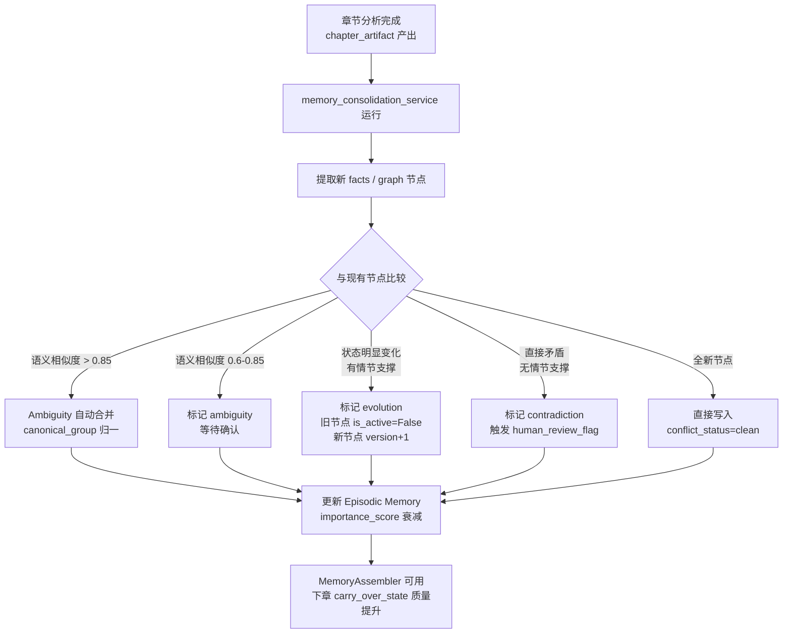

# 冲突代谢机制 / Conflict Metabolism

---

## 1. 为什么需要冲突代谢

### 当前问题

现有系统的 `graph_nodes` 和 `fact_records` 是**追加式**的：
- 第 10 章说"张三是好人"，第 30 章说"张三是坏人"，两条记录都在，没有消解
- 第 15 章建立了规则 A，第 25 章打破了规则 A，两条记录都在，checker 可能误判
- 伏笔在第 5 章埋下，第 40 章兑现，但系统不知道这两条是同一件事

### 代谢的含义

> 代谢不是删除，而是**标记关系**：
> - 哪些记录是矛盾的（contradiction）
> - 哪些记录是演进的（evolution，旧状态被新状态取代）
> - 哪些记录是模糊的（ambiguity，需要人工确认）
> - 哪些记录已经解决（resolved）

---

## 2. 冲突分类

### 2.1 Contradiction（直接矛盾）

**定义**：同一实体在同一时间线上有互斥的状态描述。

**示例**：
- 角色 A 在第 20 章"死亡"，但第 25 章又"出现"且没有解释
- 规则"不得使用魔法"在第 10 章建立，第 15 章被角色使用但没有说明例外

**处理**：
```
标记 conflict_status = 'contradiction'
触发 human_review_flag = True
不自动消解，等待人工确认或 LLM adjudication
```

---

### 2.2 Evolution（状态演进）

**定义**：同一实体的状态随情节发展而合理变化，旧状态被新状态取代。

**示例**：
- 角色 A 从"敌对"变为"中立"（有明确的和解情节）
- 规则 B 从"严格执行"变为"废除"（有明确的废除情节）

**处理**：
```
旧节点：version += 1，is_active = False，superseded_by_node_id = 新节点 ID
新节点：version = 旧节点 version + 1，is_active = True
conflict_status = 'evolution'（记录这是演进，不是矛盾）
```

---

### 2.3 Ambiguity（模糊待确认）

**定义**：两条记录语义相似但不完全相同，不确定是同一件事还是两件事。

**示例**：
- "张三受伤" vs "张三负伤" — 是同一事件的不同描述，还是两次不同受伤？
- 规则"禁止入内" vs "无令牌不得进入" — 是同一规则的不同表述，还是两条规则？

**处理**：
```
标记 conflict_status = 'ambiguity'
用 pgvector 计算语义相似度
相似度 > 0.85：自动合并为同一节点（canonical_group 相同）
相似度 0.6-0.85：标记为 ambiguity，等待人工确认
相似度 < 0.6：视为不同节点，不处理
```

---

### 2.4 Resolved（已解决）

**定义**：之前标记为 contradiction 或 ambiguity 的冲突，已经被人工确认或情节发展解决。

**处理**：
```
conflict_status = 'resolved'
resolution_note = "第 X 章通过 Y 情节解决"
```

---

## 3. 代谢流程



---

## 4. 与现有服务的集成

### 4.1 `memory_consolidation_service.py`（新增）

```python
# novel_analyzer/services/memory_consolidation_service.py

class MemoryConsolidationService:
    """
    每章分析完成后运行，执行冲突检测和代谢。
    依赖现有：
    - risk_semantic_signal_service（语义信号）
    - risk_signal_store_service（pgvector ANN 检索）
    - graph_service（图谱读写）
    - fact_service（事实读写）
    """

    def consolidate(self, branch_id: str, chapter_index: int) -> ConsolidationResult:
        """
        1. 读取本章新产出的 graph_nodes / fact_records
        2. 用 pgvector ANN 检索语义相似的历史节点
        3. 按相似度分类：contradiction / evolution / ambiguity / clean
        4. 更新 conflict_status / version / is_active 字段
        5. 对 fact_records 执行 importance_score 衰减
        6. 返回 ConsolidationResult（包含冲突摘要，供 operator surface 展示）
        """
        ...

    def _detect_contradiction(
        self, new_node: GraphNode, similar_nodes: list[GraphNode]
    ) -> bool:
        """
        判断是否为直接矛盾：
        - 同一实体，状态互斥
        - 无情节支撑的状态跳变
        使用规则判断，不调用 LLM（保持可解释性）
        """
        ...

    def _detect_evolution(
        self, new_node: GraphNode, old_node: GraphNode, chapter_artifact: dict
    ) -> bool:
        """
        判断是否为合理演进：
        - chapter_artifact 中有明确的状态转变描述
        - state_transition_notes 中有对应记录
        """
        ...

    def _decay_episodic_importance(
        self, branch_id: str, current_chapter: int
    ) -> None:
        """
        对 fact_records 执行重要性衰减：
        - 普通事件：decay_factor × 0.95 每章
        - 关键事件（importance_score > 0.8）：decay_factor × 0.99 每章
        - 已解决的线程：decay_factor × 0.8（加速衰减）
        """
        ...
```

### 4.2 触发时机

```python
# 在 analysis_service.py 的章节分析完成后追加调用（feature flag 控制）

if settings.LOOM_MEMORY_ENABLED:
    consolidation_service.consolidate(branch_id, chapter_index)
```

---

## 5. 与 0509 控制层的对接

### 冲突摘要接入 operator_surface

`ConsolidationResult` 包含：
```json
{
  "chapter_index": 42,
  "contradictions_found": 2,
  "evolutions_recorded": 5,
  "ambiguities_pending": 1,
  "human_review_required": true,
  "conflict_summary": [
    {
      "type": "contradiction",
      "entity": "张三",
      "description": "第42章状态与第30章矛盾",
      "requires_action": true
    }
  ]
}
```

这个摘要可以作为 0509 `operator_surface` 的新信号字段，
让 operator 在控制台看到"本章有 N 个记忆冲突需要处理"。

---

## 6. 验收标准

- [ ] 连续 30 章仿写后，`graph_nodes` 中 `conflict_status='contradiction'` 的节点数量可见
- [ ] `evolution` 类型的节点正确维护 `version` 链（旧节点 → 新节点可追溯）
- [ ] `ambiguity` 类型的节点在 pgvector 相似度 > 0.85 时自动合并
- [ ] `memory_consolidation_service` 运行时间 < 5 秒（单章）
- [ ] feature flag 关闭时，现有链路完全不受影响

---

返回 [Memory 层入口](./README.md) | [三层记忆设计](./layered-memory-design.md) | [迁移方案](./carry-over-migration.md)
