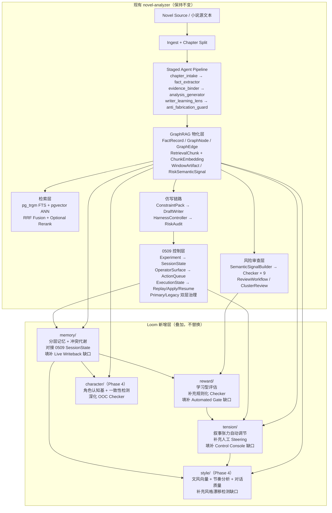

# Loom 架构全景 / Overview

---

## 1. 完整架构图

---

## 2. 现有 GraphRAG 基础设施盘点

Loom 直接复用以下已有能力，**不新建依赖**：

| 现有资产 | DB 表 / 服务 | Loom 用途 |
|---------|------------|---------|
| 知识图谱 | `graph_nodes` + `graph_edges` | Semantic Memory 层的持久化存储 |
| 事实记录 | `fact_records` | Episodic Memory 层的事件序列 |
| 向量检索 | `chunk_embeddings` + pgvector | 张力指标 `plot_similarity_score` 计算 |
| 语义信号 | `risk_semantic_signals`（含 `vector_payload`） | 冲突检测的语义归并 |
| 信号链接 | `risk_signal_links` | 冲突代谢的 link 追踪 |
| 窗口摘要 | `window_artifacts` | Working Memory 的压缩来源 |
| 人工评审 | `manual_eval_record` + `reader_feedback_comments` | Pairwise 评估数据来源 |
| Trope/Worldview | `rag/` 目录 + `steering_library_service` | Obstacle 注入的知识库 |
| 0509 控制层 | `writer-imitate-session-state.json` 等产物 | Working Memory 的运行时入口 |

---

## 3. SOTA 对比表

| 维度 | 当前系统 | SOTA 方法 | Gap | Loom 方案 |
|------|---------|----------|-----|---------|
| **记忆机制** | `carry_over_state` 线性追加，无冲突消解 | EvoSpark（ACL 2026）Stratified Narrative Memory，动态代谢历史冲突 | 🔴 高 → 🟡 Phase 1 架构就绪 | 三层记忆（Working/Episodic/Semantic）+ 冲突代谢，复用现有 GraphNode/FactRecord |
| **角色一致性** | snapshot 状态 + OOC checker | BookWorld（2025）角色 agent 自主认知基 | 🔴 高 → 🟡 Phase 3 进行中 | Phase 1 分层记忆 + Phase 3/4 角色认知基（character_agent_service） |
| **仿写评估** | 规则化 checker，固定维度 | EvolvR（2025-2026）学习型 pairwise reward model，SOTA on StoryER/HANNA/OpenMEVA | 🟡 中 → 🟢 Phase 3 工具就绪 | LLM-as-judge pairwise → fine-tuned reward model（待数据积累） |
| **情节张力** | 人工 steering pack | KG+Literary Theory（2025）obstacle framework + 相似度控制 | 🟡 中 → 🟢 Phase 2 已实现 | 三个张力指标（直接用现有 pgvector），自动 obstacle 注入 |
| **历史压缩** | 全量 carry_over | StoryWriter（2025）动态事件相关压缩 | 🟡 中 → 🟢 Phase 1 已实现 | Working Memory 按事件相关性压缩，而非时间顺序 |
| **风格量化** | 风格轴文本描述，无向量化 | StyleRPA（2024）风格向量 + 相似度评估 | 🟡 中 → Phase 4 规划 | style_calibration_service：复用 ChunkEmbedding 做风格向量 + 漂移检测 |
| **节奏/爽点** | hook_score + scene_beats，无密度模型 | 网文商业实践：爽点密度模型 + 高潮点检测 | 🔴 高 → Phase 4 规划 | rhythm_analysis_service：hook_density + climax_position + pacing_type |
| **对话设计** | 只能抽取 dialogue candidates | CharacterBench（2024）角色对话一致性评估 | 🔴 高 → Phase 4 规划 | dialogue_signal：character_voice_consistency + dialogue_efficiency |
| **读者模拟** | 系统级 review，无读者视角 | HANNA benchmark（2023）多维度读者评估 | 🔴 高 → Phase 5 规划 | reader_simulation_service：4 类读者面板（casual/veteran/satisfaction/editor） |
| **多线调度** | unresolved_threads 列表，无调度器 | 叙事学多线平衡理论 | 🟡 中 → Phase 5 规划 | thread_scheduler_service：active/dormant/overdue 三类线索分类 |
| **GraphRAG 基础** | ✅ pg_trgm + pgvector + GraphNode/GraphEdge | 学术系统大多无生产级 GraphRAG | **领先** | 直接复用，不需要升级 |
| **控制层治理** | ✅ 0509 Primary/Legacy 双层 + retirement preview | 学术系统无此能力 | **领先** | Loom 对接 0509，填补 live writeback 缺口 |
| **fine-tuning** | 无，纯 in-context | Living the Novel（2025）角色/风格专用 SFT | 🟢 低（当前阶段可接受） | Phase 3 reward model fine-tune → Phase 4/5 风格/对话专用 SFT |

---

## 4. 设计原则

### 继承自现有系统

1. **规则优先，可解释优先**：Loom reward 层是 checker 的补充，不是替换
2. **检索与生成解耦**：张力指标用 pgvector 计算，不侵入生成链路
3. **能力逐层升级**：先可运行，再可观测，再可治理，再可规模化
4. **文档即运营面**：Loom 每个模块都有完整的 spec、sample、handoff

### Loom 新增原则

5. **记忆代谢优先于记忆堆叠**：冲突必须被消解，而不是被追加
6. **评估自进化**：评估维度应该能从人工反馈中学习，而不是永远固定
7. **张力可量化**：情节质量不能只靠人工感知，必须有可计算的代理指标
8. **0509 控制层是 Loom 的运行时入口**：不另起炉灶，直接对接已有控制层

---

## 5. 现有架构的风险

### 风险 1：长书记忆退化（高）

**表现**：连续仿写 30 章以上，`carry_over_state` 体积线性增长，模型上下文窗口压力增大，角色行为开始漂移，OOC 触发率上升。

**根因**：`carry_over_state` 是 JSON 追加，没有重要性排序，没有冲突消解，没有过期衰减。

**Loom 解法**：三层记忆 + 冲突代谢，Working Memory 按重要性压缩，Semantic Memory 持久化到 PostgreSQL。

---

### 风险 2：评估维度固化（中）

**表现**：`risk_checker` 的 9 个维度是固定的，无法从人工评审中学习新的质量维度，也无法对"好但不违规"的章节给出正向信号。

**根因**：规则化 checker 只能判断"是否违规"，不能判断"是否优秀"。

**Loom 解法**：Pairwise reward model，从 `manual_eval_record` 提取正负样本，训练能判断"哪个更好"的评估器。

---

### 风险 3：情节平淡无自动检测（中）

**表现**：批量仿写时，相邻章节情节相似度过高，读者体验下降，但系统无法自动检测，只能靠人工 steering。

**根因**：现有系统没有情节相似度的量化指标，`steering_pack` 完全依赖人工指定。

**Loom 解法**：`plot_similarity_score`（pgvector cosine）+ `conflict_density`（GraphEdge 统计）+ `surprise_index`（新实体比例），三个指标全部用现有数据计算。

---

### 风险 4：0509 控制层 live mutation 缺口（中）

**表现**：0509 的 `session_state → operator_surface → action_queue → execution_state` 链路已完整，但 `replay/apply/resume` 仍是 preview，没有真正的 live writeback。

**根因**：缺少把 preview 结果写回状态的机制，以及自动阻止不达标 retirement 的 gate。

**Loom 解法**：memory/conflict-metabolism 提供状态回写机制，reward/pairwise-eval-design 提供自动质量门控。

---

## 6. Loom 的优势

相比纯学术方案（EvoSpark/BookWorld/EvolvR）：
- 不需要从零构建 GraphRAG，直接复用已有 `pg_trgm + pgvector + GraphNode/GraphEdge`
- 不需要重新收集训练数据，直接从 `manual_eval_record` 提取
- 不需要新的 LLM 调用来计算张力指标，直接用现有 `ChunkEmbedding`

相比现有系统：
- 记忆不再线性退化，长书仿写质量更稳定
- 评估维度可以从人工反馈中学习，不再固化
- 情节质量有量化指标，不再完全依赖人工感知
- 0509 控制层的 🔴 缺口被系统性填补

---

返回 [Loom 入口](./README.md) | [文档中心](../README.md) | [差距分析与演进](./gap-analysis-and-evolution.md)
