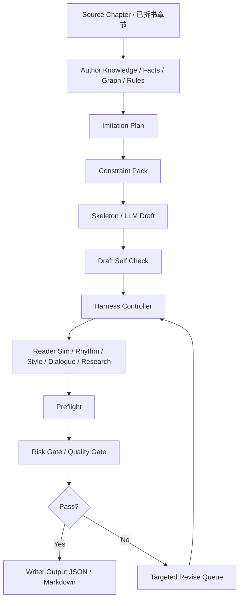

# Writer Imitation Workflow / 小说仿写实战流程

本流程面向真实仿写实战，默认工作目录为：
- `output/`

约束：
- `output/` 只作为工作目录
- 不提交进 Git
- 最终沉淀到仓库的应是：代码、流程文档、评估结论，而不是每次仿写草稿

---

## 1. 当前建议入口

### 1.1 单章仿写
```bash
./.venv/bin/novel-analyzer writer-imitate <branch_id> <source_chapter_index> "<target_goal>" --output-dir output
```

输出：
- `output/writer-imitate-ch<idx>.json`
- `output/writer-imitate-ch<idx>.md`

### 1.2 多章批量仿写
```bash
./.venv/bin/novel-analyzer writer-imitate-range <branch_id> '3:目标A' '4:目标B' --output-dir output
```

输出：
- `output/writer-imitate-range-3-4.json`
- `output/writer-imitate-range-3-4.md`

---

## 2. 推荐实战顺序
1. 先完成拆书 / facts / graph / risk 主链
2. 用 `show-author-knowledge` / `export-author-knowledge` 确认人物、关系、规则、线程
3. 先跑 `writer-imitate` 拿结构化 draft
4. 看 `risk_gate_notes / policy_summary / final_verdict`
5. 如果要连续多章，再跑 `writer-imitate-range`
6. 必要时上：
   - `preflight-imitation`
   - `harness-imitation`
   - `iterate-imitation`
   - `run-whole-book-imitation`

## 2.1 仿写执行流程图



说明：
- 左半边解决“写什么、不能怎么写”
- 中间解决“如何起草、如何修”
- 右半边解决“读者是否愿意看、风险是否可过、最后输出什么”

---

## 3. 当前仿写链路包含什么

### 已有能力
- source chapter intake
- fact extraction
- imitation constraint pack
- skeleton / llm draft
- draft self-check
- style calibration
- rhythm analysis
- reader-sim review
- dialogue review
- targeted revise queue
- risk gate notes
- policy summary
- multi-round harness
- whole-book queue / sandbox execute

### 新增：外置世界观 / 套路 steering pack
当前仿写不应只“贴着原章走”，还可以显式接入外置创新导向：
- `--worldview-note`：补世界观外置胶囊
- `--trope-axis`：补题材套路轴
- `--innovation-directive`：补本轮创新导向
- `--taboo-innovation`：补禁止创新越界项
- `--knowledge-ref`：补外部知识/读者预期参考

这层能力的意义不是直接替代 source context，而是把“新的底座和内涵创新”显式注入 imitation plan / constraint pack / harness。

示例：
```bash
./.venv/bin/novel-analyzer writer-imitate <branch_id> 24 "压住成绩爽点，但拉高阶层跃迁冲击" \
  --worldview-note "灵气衰败时代，资源与身份强绑定" \
  --trope-axis "底层逆袭" \
  --trope-axis "账本修仙" \
  --innovation-directive "把修炼收益折算为社会信用与家族博弈" \
  --taboo-innovation "不要突然引入无代价系统外挂" \
  --knowledge-ref "男频修仙读者期待先压后扬、收益可见" \
  --output-dir output
```

### 当前 writer-facing 包装层补齐了什么
- 更适合写手直接用的统一入口
- 自动把结果写到 `output/`
- 自动产出 `json + markdown`
- 不需要每次手工拼 CLI 组合

---

## 4. 实战时重点关注字段

### 单章仿写
重点看：
- `final_draft.draft_title`
- `final_draft.draft_text`
- `final_draft.risk_gate_notes`
- `final_verdict`
- `stop_reason`
- `policy_summary`

### 多章仿写
重点看：
- 每章 `final_verdict`
- 每章 `stop_reason`
- 每章 `final_draft`
- 是否出现连续性的 carry-over 问题

---

## 5. 当前最重要的仿写实战原则
1. **先保连续性，再追求表面文风像**
2. **先保人物/规则/线程不崩，再追求“写得像”**
3. **把 risk gate 当硬门，而不是装饰信息**
4. **output 只是工作区，不是最终知识库**
5. **发现真实问题就修流程/代码，不要只改一份草稿了事**

---

## 6. 与你给的 writer-imitate 参考的对齐点
当前我们已经覆盖或接近覆盖：
- 章节窗口化上下文
- story bible / author knowledge 约束注入
- imitation constraint pack
- draft + self-check + revise queue
- 风险门控
- reader-sim / style / rhythm / dialogue repair lanes
- whole-book carry-over 与 consistency

当前仍值得继续补强的点：
- 更明确的 writer-facing continuation notes
- 更直接的“这一章为什么这么写”的编剧式说明
- output 目录下更标准化的批量实验记录
- source / target / repaired draft 的并排对照产物

当前 innovation experiment 已开始补这层说明：
- `writer_innovation_explanation.summary`
- `writer_innovation_explanation.focus`
- markdown 中的 `Writer Innovation Explanation` 区块
- `writer-imitate-index.md` 中的 experiment 汇总入口
- `writer-imitate-session-state.json` 中的机读 session 状态快照
- `writer-imitate-index.md` 中的 Experiment Ledger 连续复盘视图
- `writer-imitate-index.md` 中的 session-level promotion verdict / risk register / handoff summary
- `writer-imitate-index.md` 中的 session_ship_decision / session_blockers / session_required_review / session_owner_handoff / session_priority_queue
- `writer-imitate-index.md` 中的 session_lane_status / session_escalation_path / session_release_readiness / session_recovery_plan / session_command_brief
- `writer-imitate-index.md` 中的 session_execution_mode / session_action_window / session_ready_queue / session_blocked_queue / session_recovery_owner
- `writer-imitate-index.md` 中的 session_runtime_contract / session_state_snapshot / session_transition_rules / session_auto_actions / session_manual_overrides
- `writer-imitate-index.md` 中的 session_guard_conditions / session_entry_criteria / session_exit_criteria / session_auto_escalations / session_override_audit
- `writer-imitate-index.md` 中的 session_state_machine / session_allowed_transitions / session_trigger_matrix / session_reconciliation_steps / session_operator_commands
- `writer-imitate-index.md` 中的 session_policy_pack / session_slo_contract / session_failure_domains / session_intervention_matrix / session_audit_digest
- `writer-imitate-index.md` 中的 session_governor_mode / session_decision_bus / session_watchdog_rules / session_contingency_routes / session_operating_envelope
- `writer-imitate-index.md` 中的 session_control_objectives / session_enforcement_rules / session_decision_priorities / session_supervision_hooks / session_telemetry_digest
- `writer-imitate-index.md` 中的 session_policy_versions / session_safety_budget / session_latency_budget / session_review_quorum / session_contract_digest
- `writer-imitate-index.md` 中的 session_compliance_pack / session_failure_budget / session_override_budget / session_reliability_digest / session_governance_checksum
- `writer-imitate-index.md` 中的 session_authority_map / session_escalation_budget / session_remediation_contract / session_consensus_rules / session_integrity_digest
- `writer-imitate-index.md` 中的 session_control_memory / session_constraint_register / session_safety_invariants / session_repair_budget / session_runtime_digest
- `writer-imitate-index.md` 中的 session_control_fabric / session_guardrail_matrix / session_override_protocol / session_failure_isolation / session_runtime_manifest
- `writer-imitate-index.md` 中的 session_control_bus / session_event_channels / session_runtime_priorities / session_alert_routes / session_state_checkpoint
- `writer-imitate-index.md` 中的 session_execution_graph / session_signal_registry / session_action_contract / session_backpressure_rules / session_runtime_proof
- `writer-imitate-index.md` 中的 session_supervisory_contract / session_recovery_matrix / session_signal_budget / session_checkpoint_policy / session_operating_ledger
- `writer-imitate-index.md` 中的 session_governance_fabric / session_checkpoint_contract / session_supervision_priorities / session_ledger_consistency_rules / session_runtime_attestation
- `writer-imitate-index.md` 中的 session_runtime_mesh / session_policy_router / session_checkpoint_ring / session_audit_stream / session_operating_signature
- `writer-imitate-index.md` 中的 session_policy_mesh / session_enforcement_bus / session_runtime_sentry / session_checkpoint_audit_chain / session_operating_posture
- `writer-imitate-index.md` 中的 session_attestation_chain / session_trust_zones / session_policy_attestors / session_recovery_posture / session_control_verdict
- `writer-imitate-index.md` 中的 session_protocol_stack / session_trust_contract / session_recovery_authority / session_audit_checkpoint_map / session_runtime_certificate
- `writer-imitate-index.md` 中的 session_governance_topology / session_protocol_budget / session_certificate_chain / session_recovery_authorizations / session_control_attestation
- `writer-imitate-index.md` 中的 session_control_kernel / session_safety_circuit_breakers / session_override_channels / session_repair_loops / session_operating_checksum
- `experiment_decision_note` 用于是否推广 / pilot / de-risk / hold 的操作结论
- `pilot_scope / promotion_gate / rollback_trigger / evidence_required` 用于 rollout 闭环
- `ship_blockers / required_human_review / confidence_level / business_risk_label / go_live_checklist` 用于 go-live gate
- `success_kpi_targets / failure_kpi_triggers / observation_window / owner_roles / handoff_packet` 用于上线后运营合同

---

## 7. 推荐下一步实战增强
1. 把外置世界观 / 套路 steering pack 与真实 trope/worldview 资料做成可检索 RAG surface
2. 补一个 `writer-imitate-session`，把同一轮多章实验的 notes / artifacts 聚合进 output 子目录
3. 对真实仿写章节做一次“边写边修”的长链实验，持续发现问题并优化
4. 在 reader-sim / risk / style 之外，再引入更强的“创新收益 vs 越界风险”平衡检查
