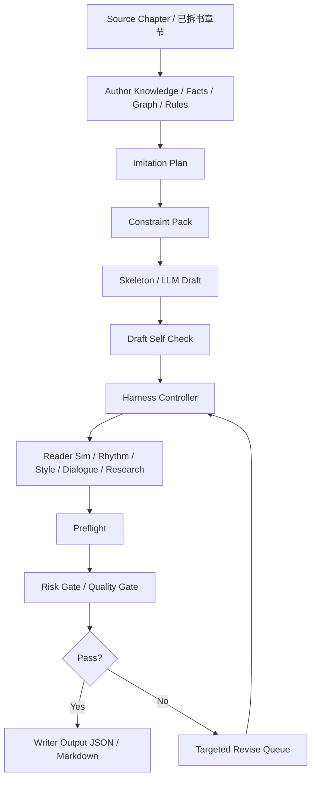
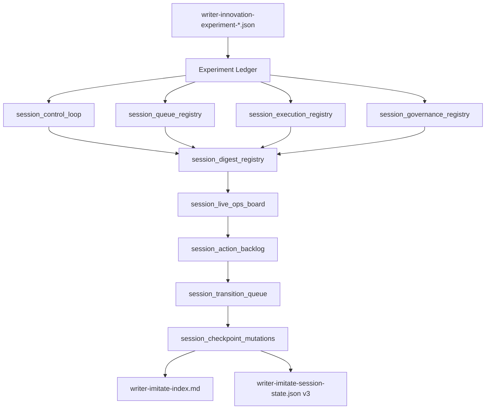

# Writer Imitation Workflow / 小说仿写实战流程

本流程面向真实仿写实战，默认工作目录为：
- `output/`

约束：
- `output/` 只作为工作目录
- 不提交进 Git
- 最终沉淀到仓库的应是：代码、流程文档、评估结论，而不是每次仿写草稿

---

## 1. 当前建议入口

### 1.1 单章仿写
```bash
./.venv/bin/novel-analyzer writer-imitate <branch_id> <source_chapter_index> "<target_goal>" --output-dir output
```

输出：
- `output/writer-imitate-ch<idx>.json`
- `output/writer-imitate-ch<idx>.md`

### 1.2 多章批量仿写
```bash
./.venv/bin/novel-analyzer writer-imitate-range <branch_id> '3:目标A' '4:目标B' --output-dir output
```

输出：
- `output/writer-imitate-range-3-4.json`
- `output/writer-imitate-range-3-4.md`

---

## 2. 推荐实战顺序
1. 先完成拆书 / facts / graph / risk 主链
2. 用 `show-author-knowledge` / `export-author-knowledge` 确认人物、关系、规则、线程
3. 先跑 `writer-imitate` 拿结构化 draft
4. 看 `risk_gate_notes / policy_summary / final_verdict`
5. 如果要连续多章，再跑 `writer-imitate-range`
6. 必要时上：
   - `preflight-imitation`
   - `harness-imitation`
   - `iterate-imitation`
   - `run-whole-book-imitation`
7. 如果对 control-plane / governance / replay 等英文术语理解成本高，补看 `docs/imitation-control-plane-glossary.md`
8. 如果想看当前最新完整控制层架构总图，补看 `docs/architecture/imitation-commercial-agent-control-plane-architecture-20260509.md`
9. 如果想看当前控制层怎样支撑商业运营闭环，补看 `docs/architecture/imitation-commercial-agent-ops-closed-loop-20260509.md`
10. 如果想快速判断哪些能力已落地、哪些还只是 preview / 规划中，补看 `docs/architecture/imitation-control-plane-implementation-status-map-20260509.md`
11. 如果想看字段层、产物层、控制台层如何一一映射，补看 `docs/architecture/imitation-control-plane-field-artifact-console-map-20260509.md`
12. 如果想看 legacy 字段真正 retirement 前的完整路线，补看 `docs/architecture/imitation-legacy-retirement-roadmap-20260509.md`
13. 如果想看从当前 preview/governance 结构走到第一次真正 live mutation / apply / retirement patch 还差哪些桥，补看 `docs/architecture/imitation-live-mutation-bridge-roadmap-20260509.md`

## 2.1 仿写执行流程图



说明：
- 左半边解决“写什么、不能怎么写”
- 中间解决“如何起草、如何修”
- 右半边解决“读者是否愿意看、风险是否可过、最后输出什么”

---

## 3. 当前仿写链路包含什么

### 已有能力
- source chapter intake
- fact extraction
- imitation constraint pack
- skeleton / llm draft
- draft self-check
- style calibration
- rhythm analysis
- reader-sim review
- dialogue review
- targeted revise queue
- risk gate notes
- policy summary
- multi-round harness
- whole-book queue / sandbox execute

### 新增：外置世界观 / 套路 steering pack
当前仿写不应只“贴着原章走”，还可以显式接入外置创新导向：
- `--worldview-note`：补世界观外置胶囊
- `--trope-axis`：补题材套路轴
- `--innovation-directive`：补本轮创新导向
- `--taboo-innovation`：补禁止创新越界项
- `--knowledge-ref`：补外部知识/读者预期参考

这层能力的意义不是直接替代 source context，而是把“新的底座和内涵创新”显式注入 imitation plan / constraint pack / harness。

示例：
```bash
./.venv/bin/novel-analyzer writer-imitate <branch_id> 24 "压住成绩爽点，但拉高阶层跃迁冲击" \
  --worldview-note "灵气衰败时代，资源与身份强绑定" \
  --trope-axis "底层逆袭" \
  --trope-axis "账本修仙" \
  --innovation-directive "把修炼收益折算为社会信用与家族博弈" \
  --taboo-innovation "不要突然引入无代价系统外挂" \
  --knowledge-ref "男频修仙读者期待先压后扬、收益可见" \
  --output-dir output
```

### 当前 writer-facing 包装层补齐了什么
- 更适合写手直接用的统一入口
- 自动把结果写到 `output/`
- 自动产出 `json + markdown`
- 不需要每次手工拼 CLI 组合

---

## 4. 实战时重点关注字段

### 单章仿写
重点看：
- `final_draft.draft_title`
- `final_draft.draft_text`
- `final_draft.risk_gate_notes`
- `final_verdict`
- `stop_reason`
- `policy_summary`

### 多章仿写
重点看：
- 每章 `final_verdict`
- 每章 `stop_reason`
- 每章 `final_draft`
- 是否出现连续性的 carry-over 问题

---

## 5. 当前最重要的仿写实战原则
1. **先保连续性，再追求表面文风像**
2. **先保人物/规则/线程不崩，再追求“写得像”**
3. **把 risk gate 当硬门，而不是装饰信息**
4. **output 只是工作区，不是最终知识库**
5. **发现真实问题就修流程/代码，不要只改一份草稿了事**

---

## 6. 与你给的 writer-imitate 参考的对齐点
当前我们已经覆盖或接近覆盖：
- 章节窗口化上下文
- story bible / author knowledge 约束注入
- imitation constraint pack
- draft + self-check + revise queue
- 风险门控
- reader-sim / style / rhythm / dialogue repair lanes
- whole-book carry-over 与 consistency

当前仍值得继续补强的点：
- 更明确的 writer-facing continuation notes
- 更直接的“这一章为什么这么写”的编剧式说明
- output 目录下更标准化的批量实验记录
- source / target / repaired draft 的并排对照产物

当前 innovation experiment 已开始补这层说明：
- `writer_innovation_explanation.summary`
- `writer_innovation_explanation.focus`
- markdown 中的 `Writer Innovation Explanation` 区块
- `writer-imitate-index.md` 中的 experiment 汇总入口
- `writer-imitate-session-state.json` 中的机读 session 状态快照
- `writer-imitate-index.md` 中的 Experiment Ledger 连续复盘视图
- `writer-imitate-index.md` 中的 session-level promotion verdict / risk register / handoff summary
- `writer-imitate-index.md` 中的 session_ship_decision / session_blockers / session_required_review / session_owner_handoff / session_priority_queue
- `writer-imitate-index.md` 中的 session_lane_status / session_escalation_path / session_release_readiness / session_recovery_plan / session_command_brief
- `writer-imitate-index.md` 中的 session_execution_mode / session_action_window / session_ready_queue / session_blocked_queue / session_recovery_owner
- `writer-imitate-index.md` 中的 session_runtime_contract / session_state_snapshot / session_transition_rules / session_auto_actions / session_manual_overrides
- `writer-imitate-index.md` 中的 session_guard_conditions / session_entry_criteria / session_exit_criteria / session_auto_escalations / session_override_audit
- `writer-imitate-index.md` 中的 session_state_machine / session_allowed_transitions / session_trigger_matrix / session_reconciliation_steps / session_operator_commands
- `writer-imitate-index.md` 中的 session_policy_pack / session_slo_contract / session_failure_domains / session_intervention_matrix / session_audit_digest
- `writer-imitate-index.md` 中的 session_governor_mode / session_decision_bus / session_watchdog_rules / session_contingency_routes / session_operating_envelope
- `writer-imitate-index.md` 中的 session_control_objectives / session_enforcement_rules / session_decision_priorities / session_supervision_hooks / session_telemetry_digest
- `writer-imitate-index.md` 中的 session_policy_versions / session_safety_budget / session_latency_budget / session_review_quorum / session_contract_digest
- `writer-imitate-index.md` 中的 session_compliance_pack / session_failure_budget / session_override_budget / session_reliability_digest / session_governance_checksum
- `writer-imitate-index.md` 中的 session_authority_map / session_escalation_budget / session_remediation_contract / session_consensus_rules / session_integrity_digest
- `writer-imitate-index.md` 中的 session_control_memory / session_constraint_register / session_safety_invariants / session_repair_budget / session_runtime_digest
- `writer-imitate-index.md` 中的 session_control_fabric / session_guardrail_matrix / session_override_protocol / session_failure_isolation / session_runtime_manifest
- `writer-imitate-index.md` 中的 session_control_bus / session_event_channels / session_runtime_priorities / session_alert_routes / session_state_checkpoint
- `writer-imitate-index.md` 中的 session_execution_graph / session_signal_registry / session_action_contract / session_backpressure_rules / session_runtime_proof
- `writer-imitate-index.md` 中的 session_supervisory_contract / session_recovery_matrix / session_signal_budget / session_checkpoint_policy / session_operating_ledger
- `writer-imitate-index.md` 中的 session_governance_fabric / session_checkpoint_contract / session_supervision_priorities / session_ledger_consistency_rules / session_runtime_attestation
- `writer-imitate-index.md` 中的 session_runtime_mesh / session_policy_router / session_checkpoint_ring / session_audit_stream / session_operating_signature
- `writer-imitate-index.md` 中的 session_policy_mesh / session_enforcement_bus / session_runtime_sentry / session_checkpoint_audit_chain / session_operating_posture
- `writer-imitate-index.md` 中的 session_attestation_chain / session_trust_zones / session_policy_attestors / session_recovery_posture / session_control_verdict
- `writer-imitate-index.md` 中的 session_protocol_stack / session_trust_contract / session_recovery_authority / session_audit_checkpoint_map / session_runtime_certificate
- `writer-imitate-index.md` 中的 session_governance_topology / session_protocol_budget / session_certificate_chain / session_recovery_authorizations / session_control_attestation
- `writer-imitate-index.md` 中的 session_assurance_contract / session_policy_checksum / session_runtime_alignment / session_recovery_certainty / session_operator_assurance
- `writer-imitate-index.md` 中的 session_executive_contract / session_governance_checksum_v2 / session_supervision_certificate / session_override_liability / session_operating_authority
- `writer-imitate-index.md` 中的 session_authority_certificate / session_policy_envelope / session_escalation_authority / session_assurance_digest / session_governance_verdict
- `writer-imitate-index.md` 中的 session_governance_mesh / session_attestation_budget / session_policy_fallbacks / session_recovery_routing / session_runtime_verdict
- `writer-imitate-index.md` 中的 session_authority_fabric / session_override_chain / session_control_closure_audit / session_runtime_witness / session_governance_posture
- `writer-imitate-index.md` 中的 session_operating_charter / session_control_charter / session_governance_charter / session_runtime_authority_digest / session_final_control_verdict
- `writer-imitate-index.md` 中的 session_command_mesh / session_authority_fabric_v2 / session_closure_attestation / session_operating_charter_mesh / session_final_runtime_verdict
- `writer-imitate-index.md` 中的 session_governance_backbone / session_control_lattice / session_authority_bus / session_runtime_witness_chain / session_os_control_digest
- `writer-imitate-index.md` 中的 session_executive_command_mesh / session_authority_control_matrix / session_runtime_closure_proof / session_governance_signal_chain / session_operating_system_verdict
- `writer-imitate-index.md` 中的 session_governance_closure / session_authority_verdict / session_runtime_horizon / session_supervision_digest / session_control_summary
- `writer-imitate-index.md` 中的 session_operating_system_contract / session_control_checkpoint_digest / session_authority_signature / session_recovery_escalation_mesh / session_final_operating_posture
- `writer-imitate-index.md` 中的 session_control_plane_closure / session_exec_fabric / session_authority_routes / session_assurance_chain / session_runtime_seal
- `writer-imitate-index.md` 中的 session_meta_governor / session_policy_integrity / session_runtime_consistency / session_override_accountability / session_control_confidence
- `writer-imitate-index.md` 中的 session_control_kernel / session_safety_circuit_breakers / session_override_channels / session_repair_loops / session_operating_checksum
- `writer-imitate-index.md` 中新增的聚合视图 `session_control_loop / session_queue_registry / session_execution_registry / session_governance_registry / session_digest_registry / session_live_ops_board`
- `writer-imitate-index.md` 中新增更偏执行面的 `session_action_backlog / session_transition_queue / session_checkpoint_mutations`
- `writer-imitate-index.md` 的 `Operator-Facing Stable Contract` 小节已开始把第一层真正应该先看的状态 / 队列 / owner / 迁移 / 摘要字段收口出来
- `writer-imitate-operator-surface.json/.md` 已作为独立默认入口产物补上，控制台/运营面可以直接消费这一层，而不必先读更大的 session-state
- `writer-imitate-operator-surface` 现在还会额外收口 `session_primary_verdicts` 与 `session_primary_digests`，作为 P1 重复字段家族收敛的低风险入口
- `action-queue / execution-state / execution-replay / execution-apply / execution-resume` 这些产物也开始同步暴露并渲染 `session_primary_verdicts / session_primary_digests`，让主 verdict/digest 入口不只停留在 operator-surface
- 现在还额外暴露 `session_primary_contract_hints`，明确告诉消费者：primary verdict/digest 已是推荐入口，而旧字段族仍处于 compatibility layer
- 现已进一步新增 `session_legacy_contract_layer`，把旧 verdict/digest 家族正式收成独立可机读兼容层对象，而不只是散落在 hints 文本里
- 现在还额外产出 `writer-imitate-legacy-contract-surface.json/.md`，把 legacy compatibility layer 单独抽成可消费入口，避免旧字段家族长期散落在主控制面
- 现在 action/execution/replay/apply/resume 等主产物也会统一暴露 `legacy_operator_entrypoint`，让 legacy surface 作为次级入口被显式发现，而不是只存在于新增产物清单里
- `writer-imitate-index.md` 与 `writer-imitate-session-state.json` 现在也开始显式暴露 primary/legacy 双入口，把双入口治理再上提到总入口层
- 顶层入口层现在还会额外提供 `display_policy=primary-first-legacy-secondary`，明确告诉控制台先展示 primary 层、再暴露 legacy 层
- 顶层入口层现在也开始显式暴露 `legacy_retirement_preview`，让第一次 legacy retirement 试探预演面从 root 层即可被发现
- 顶层入口层现也开始显式暴露 `live_control_state`，让 apply preview 向未来 live mutation 的桥接状态面从 root 层即可被发现
- 顶层入口层现在还会显式给出每个入口的 role / intent（如 `default-operator-home`、`compatibility-governance-surface`、`preview-to-live-bridge-surface`），让控制台不只知道入口在哪，也知道入口拿来做什么
- 顶层入口层现已进一步显式暴露 `live_mutation_preview` 与 `live-mutation-review-surface`，把真正 live executor 前的 review 面也纳入 root registry
- 顶层入口层现也开始显式暴露 `live_validation_state` 与 `local-validation-bridge-surface`，把 preview→checkpoint→transition→validation 的完整本地桥链全部接入 root registry
- 顶层入口层现也开始显式暴露 `external_runtime_executor_readiness` 与 `runtime-executor-gate-surface`，把真正跨到外部 runtime executor 前的 gate 也纳入 root registry
- 现已额外产出 `writer-imitate-control-surface-registry.json/.md`，把 root navigation / display policy / entrypoint roles 再单独收成一个 machine-readable registry 面
- `writer-imitate-operator-surface` 与 `writer-imitate-legacy-contract-surface` 现在也开始显式暴露 `session_legacy_retirement_readiness`，把真正 retirement 旧字段前的前置条件独立出来
- 现在还额外暴露 `session_legacy_retirement_plan`，把首批候选、顺序和安全规则机读化，为第一次最小 retirement 试探做准备
- 现已进一步新增 `session_legacy_retirement_pilot_wave`，把第一批最小试探波次（wave id / target family / target fields / rollback 约束）独立出来
- 现在还会额外产出 `writer-imitate-legacy-retirement-preview.json/.md`，把 readiness / pilot wave / projected effect 收成一个可消费预演面
- 现已新增 `writer-imitate-live-control-state.json/.md` 与 `writer-imitate-live-control-state` 命令，把 apply preview 的结果进一步沉淀成 live mutation 前的独立状态面
- 该 live-control-state 现已开始显式暴露 `live_mutation_readiness`，把从 preview 走到真实 writeback 还缺哪些条件单独结构化出来
- 现已进一步新增 `live_mutation_plan`，把 checkpoint writeback / transition apply / rollback strategy 的执行顺序单独结构化下来
- 现已进一步新增 `live_mutation_pilot_wave`，把第一次 live checkpoint writeback / transition apply 的最小试探波次单独对象化
- 现已新增 `writer-imitate-live-mutation-preview.json/.md` 与 `writer-imitate-live-mutation-preview` 命令，把 bridge state 上的 readiness / plan / pilot wave / projected writeback+transition 收成独立预演面
- 现已新增 `writer-imitate-live-checkpoint-state.json/.md` 与 `writer-imitate-apply-live-checkpoint` 命令，先把 checkpoint writeback 落成**本地 output 状态产物**，作为真正 live executor 前的最小可执行桥
- 现已进一步新增 `writer-imitate-live-transition-state.json/.md` 与 `writer-imitate-apply-live-transition` 命令，把 transition apply 也先落成**本地 output 状态产物**，继续沿 preview→live 的安全桥向前推进
- 现已进一步新增 `writer-imitate-live-validation-state.json/.md` 与 `writer-imitate-validate-live-state` 命令，把 checkpoint+transition 本地执行后的验证结果单独收口，形成 preview→checkpoint→transition→validation 的完整本地桥链
- 现已新增 `writer-imitate-external-runtime-executor-readiness.json/.md` 与对应命令，把从本地桥链跨到真实 external runtime executor 之前还缺哪些条件再次独立化
- 现已新增 `writer-imitate-external-runtime-executor-preview.json/.md` 与对应命令，把 runtime gate 上的 readiness + executor plan 再抽成独立 review 面，形成 root registry → runtime gate → runtime preview 的最后一跳
- markdown 第一层现在也会显式写出 compatibility note，说明 legacy verdict/digest 字段仍保留，但不再是推荐的一层入口
- 现在 `Primary Verdicts / Primary Digests` 在这些产物中的展示顺序也已被前置到 `Operator-Facing Stable Contract` 之前，正式把 primary 层提升为默认阅读路径
- `writer-imitate-index.md` 的 `Full Session Field Surface` 中，旧 verdict/digest 家族也开始被单独归到 `Legacy Verdict/Digest Compatibility Layer` 小节，避免继续在完整字段面中无差别平铺
- `writer-imitate-action-queue / execution-state / execution-replay / execution-apply / execution-resume` 这些 markdown 产物也会显式写出 `primary_operator_entrypoint: writer-imitate-operator-surface.md`，减少“先看哪个文件”的歧义
- 对应的 JSON 产物也会统一暴露 `primary_operator_entrypoint=writer-imitate-operator-surface.json`，方便控制台直接机读默认入口
- `writer-imitate-action-queue.md` 与 `writer-imitate-execution-state.md` 也开始复用同一个 `session_operator_contract`，减少不同产物各自重复拼装第一层摘要
- `writer-imitate-execution-replay / apply / resume` 也开始复用 `session_operator_contract`，使整条控制链的第一层 operator 摘要逐步统一
- 这些产物里的 `Operator-Facing Stable Contract` 渲染现已走统一 helper，后续第一层 operator 摘要调整不需要再在多个产物里重复改
- `writer-imitate-index` 现在还会额外产出：
  - `writer-imitate-action-queue.json`
  - `writer-imitate-action-queue.md`
  - `writer-imitate-execution-state.json`
  - `writer-imitate-execution-state.md`
  - `writer-imitate-execution-replay.json`
  - `writer-imitate-execution-replay.md`
  - `writer-imitate-execution-apply.json`
  - `writer-imitate-execution-apply.md`
  - `writer-imitate-execution-resume.json`
  - `writer-imitate-execution-resume.md`
- `writer-imitate-session-state.json` 已升级到 `writer-imitate-session-state.v3`，不仅保留 ready/blocked/escalation/recovery，还提供上述聚合注册表与 action-loop 入口，方便后续把 markdown 控制面接到真实调度器/看板/状态机上
- `experiment_decision_note` 用于是否推广 / pilot / de-risk / hold 的操作结论
- `pilot_scope / promotion_gate / rollback_trigger / evidence_required` 用于 rollout 闭环
- `ship_blockers / required_human_review / confidence_level / business_risk_label / go_live_checklist` 用于 go-live gate
- `success_kpi_targets / failure_kpi_triggers / observation_window / owner_roles / handoff_packet` 用于上线后运营合同

---

## 6.1 session-state v3 简化架构图



### 为什么新增这 6 个聚合注册表

- `session_control_loop`：把 entry / guard / transition / auto-action 收到一个机读对象里，避免外部系统只能重新解析几十个 markdown 字段。
- `session_queue_registry`：把 priority / ready / blocked / review / escalation / recovery 放进同一个队列面，方便后续直接接任务看板。
- `session_execution_registry`：集中表达 lane / mode / action window / recovery owner，给真实编排器一个最小可执行入口。
- `session_governance_registry`：集中表达 governor / decision bus / review quorum / authority map，避免治理字段分散后难以落地。
- `session_digest_registry`：把 runtime contract / state snapshot / operating verdict 压缩成对外摘要层，方便 API、监控面板和后续 agent runtime 直接消费。
- `session_live_ops_board`：给运营侧一个最浅层状态板，快速看到 ship / promotion / risk / focus，而不是先理解全量 taxonomy。
- `session_action_backlog`：把每个 experiment 压成 ticket，开始具备“谁负责、当前状态、要去哪个 lane、缺什么才能 unblock”的操作性。
- `session_transition_queue`：把下一跳 lane 迁移显式列出来，避免外部系统自己猜当前该往哪里切。
- `session_checkpoint_mutations`：把本轮应该回写的核心状态字段列出来，为后续 checkpoint mutation / state persistence 提供最小合同。
- `writer-imitate-execution-state.json/md`：在 action queue 之上进一步给出 execution tickets / transition history / checkpoint log / replay plan / recovery cursor，开始具备可恢复执行态的雏形。
- `writer-imitate-execution-replay.json/md`：对 execution-state 做一次“apply/replay 预演”，明确哪些 ticket 会被应用、哪些 transition/checkpoint 会进入下一步，以及恢复游标如何变化。
- `writer-imitate-apply-replay`：显式生成 apply preview，便于在真实状态回写前先确认将被应用的 ticket / transition / checkpoint。
- `writer-imitate-resume-replay`：显式生成 resume plan，把 deferred / blocked ticket 收敛成后续 review-resume / recovery-resume 动作面。

### 这一步解决了什么

- 让 `writer-imitate-session-state.json` 不再只是“结果快照”，而是开始接近“可被调度器消费的 session registry + action backlog”。
- 降低字段理解门槛：上层文档和操作面可以先看 6 个聚合视图，再按需下钻到细字段。
- 把下一步真正需要实现的 queue transition / checkpoint mutation 先显式化，而不是只停留在命名层。
- 让 `writer-imitate-action-queue.json/md` 成为一个更浅、更适合运营/编排系统直接消费的动作面，而不是每次都从全量 session-state 中提炼。
- 让 `writer-imitate-execution-state.json/md` 成为后续 replay / recovery / persisted execution state 的起点，不必从零设计执行态合同。
- 让 `writer-imitate-execution-replay.json/md` 成为真正 apply/replay mechanics 落地前的安全预演层，先验证控制流，再接入真实状态回写。
- 让 `writer-imitate-execution-apply.json/md` 与 `writer-imitate-execution-resume.json/md` 成为显式命令面，而不只是被动导出文件，后续更容易演化为真正的 apply/resume CLI。

---

## 7. 推荐下一步实战增强
1. 把外置世界观 / 套路 steering pack 与真实 trope/worldview 资料做成可检索 RAG surface
2. 在 `writer-imitate-execution-apply.v1` / `writer-imitate-execution-resume.v1` 之上补真实 action execution 与 checkpoint persistence
3. 补一个 `writer-imitate-session`，把同一轮多章实验的 notes / artifacts 聚合进 output 子目录
4. 对真实仿写章节做一次“边写边修”的长链实验，持续发现问题并优化
5. 在 reader-sim / risk / style 之外，再引入更强的“创新收益 vs 越界风险”平衡检查
